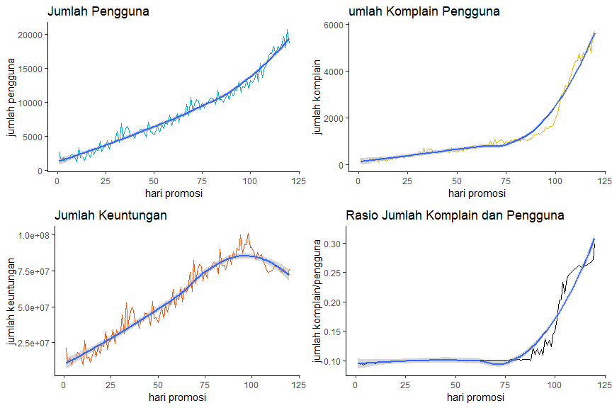
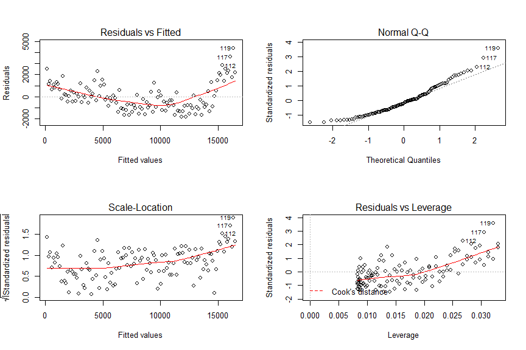
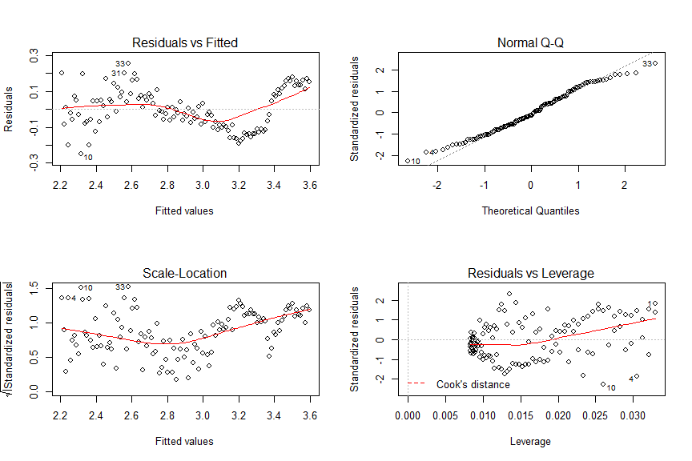
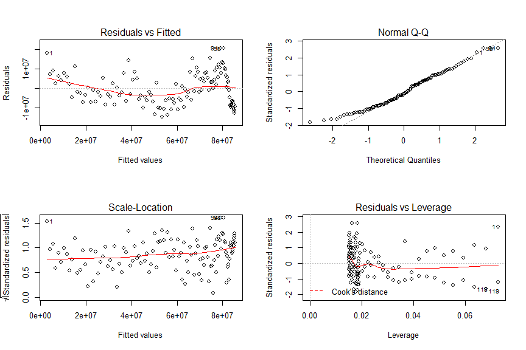

# Business Problems

OK-CLEAN merupakan layanan kebersihan profesional berbasis aplikasi yang tersedia di berbagai kota di Indonesia. Layanan yang diberikan meliputi membersihkan taman rumah, ruang tamu, dapur, toilet, dan lain – lain. Layanan tersebut dikerjakan oleh Mitra OK-CLEAN.

Kota Bandung merupakan salah satu wilayah cakupan layanan OK-CLEAN. Di Kota Kembang ini, layanan kebersihan telah dirilis sejak 6 bulan belakangan. Ribuan konsumen telah menggunakan layanan tersebut. Namun, Manajer Umum OK-CLEAN menilai bahwa pasar tersebut belum memuaskan dan masih terdapat peluang yang sangat besar untuk dieksploitasi.

Manajer Umum memerintahkan Manajer Pemasaran untuk melakukan promosi besar – besaran selama 120 hari penuh. Manajer Pemasaran mulai melakukan perencanaan strategi pemasaran dengan berkolaborasi bersama Manajer Layanan Konsumen dan Manajer Keuangan. Upaya pemasaran direncanakan dengan memberikan potongan harga yang semakin besar di akhir periode promosi. Namun, keputusan tersebut memiliki risiko yaitu Mitra OK-CLEAN sering melakukan pelayanan yang tidak sesuai dengan standar ketika konsumen memesan layanan dengan menggunakan potongan harga yang besar.

Bagian Layanan Konsumen dan Bagian Keuangan selalu erat kaitannya dengan perilaku Mitra OK-CLEAN. Ketika Mitra OK-CLEAN dinilai memiliki kinerja yang buruk atau merugikan konsumen, maka komplain yang diterima oleh Bagian Layanan Konsumen OK-CLEAN akan meningkat dan ganti rugi yang harus diproses oleh Bagian Keuangan juga semakin besar nilainya.
Strategi promosi selama 120 hari telah dieksekusi sesuai dengan yang direncakan. Pergerakan jumlah konsumen diarsipkan oleh Manajer Pemasaran pada dataset [**"001_ok-clean_pengguna.csv"**](https://github.com/r-academy/mlearn-capstone/raw/master/data-raw/001_ok-clean_penggunaan.csv), pergerakan jumlah komplain diarsipkan oleh Manajer Layanan Konsumen pada dataset [**"001_ok-clean_komplain.csv"**](https://github.com/r-academy/mlearn-capstone/raw/master/data-raw/001_ok-clean_komplain.csv), dan pergerakan  keuntungan perusahaan diarsipkan oleh Manajer Keuangan pada dataset [**"001_ok-clean_keuntungan.csv"**](https://github.com/r-academy/mlearn-capstone/raw/master/data-raw/001_ok-clean_keuntungan.csv).

Manajer Umum OK-CLEAN mengadakan pertemuan bersama Manajer Pemasaran, Manajer Layanan Konsumen, dan Manajer Keuangan segera setelah periode promosi berakhir. Pertemuan tersebut membahas tentang proyeksi pergerakan jumlah konsumen, komplain, dan keuntungan di masa yang akan datang berdasarkan data yang diperoleh selama 120 hari promosi.

Untuk itu, Manajer Umum meminta masing – masing manajer untuk menyediakan data sebagai berikut:

**Bagi Manajer Pemasaran**

+ Pola yang terbentuk dari data arsip jumlah pengguna dengan menggunakan grafik yang menarik.
+ Prediksi jumlah pengguna diakhir periode ketika upaya pemasaran dilanjutkan menjadi 130 hari.
+ Prediksi jumlah pengguna diakhir periode ketika upaya pemasaran dilanjutkan menjadi 150 hari.
+ Prediksi jumlah pengguna diakhir periode ketika upaya pemasaran dilanjutkan menjadi 200 hari.

**Bagi Manajer Layanan Konsumen**

+ Pola yang terbentuk dari data arsip jumlah komplain dengan menggunakan grafik yang menarik.
+ Prediksi jumlah komplain diakhir periode ketika upaya pemasaran dilanjutkan menjadi 130 hari.
+ Prediksi jumlah komplain diakhir periode ketika upaya pemasaran dilanjutkan menjadi 150 hari.
+ Prediksi jumlah komplain diakhir periode ketika upaya pemasaran dilanjutkan menjadi 200 hari.

**Bagi Manajer Keuangan:**

+ Pola yang terbentuk dari data arsip jumlah keuntungan dengan menggunakan grafik yang menarik.
+ Prediksi jumlah keuntungan diakhir periode ketika upaya pemasaran dilanjutkan menjadi 130 hari.
+ Prediksi jumlah keuntungan diakhir periode ketika upaya pemasaran dilanjutkan menjadi 150 hari.
+ Prediksi jumlah keuntungan diakhir periode ketika upaya pemasaran dilanjutkan menjadi 200 hari.

**Bagi Ketiga Manajer**

+ Adakah pola mencurigakan yang terjadi dalam data pada masing – masing arsip?
+ Kapan pola tersebut tersebut mulai terjadi?
+ Mengapa hal tersebut dapat terjadi?
+ Akankah temuan tersebut jika berlangsung secara terus – menerus dapat merugikan perusahaan?
+ Keputusan apa yang sebaiknya diambil oleh perusahaan?

# Aktivasi Library

Terdapat 3 buah library yang diperlukan dalam melakukan analisa terhadap data perusahaan tersebut. Library tersebut antara lain:

1. `tidyverse`: kumpulan library untuk melakukan analisis data seperti: `tidyr` (import data), `ggplot2` (visualisasi data), `dplyr` (transformasi data), dll.
2. `gridExtra`: menggabungkan beberapa visualisasi data ke dalam satu jendela.


```r
library(tidyverse)
library(gridExtra)
```

# Import Data

Terdapat beberapa data yang perlu dimuat untuk melakukan analisa ini. Data yang perlu dimuat antara lain:

1. data pergerakan jumlah konsumen diarsipkan oleh Manajer Pemasaran pada dataset [**"001_ok-clean_pengguna.csv"**](https://github.com/r-academy/mlearn-capstone/raw/master/data-raw/001_ok-clean_penggunaan.csv). 
2. data pergerakan jumlah komplain diarsipkan oleh Manajer Layanan Konsumen pada dataset [**"001_ok-clean_komplain.csv"**](https://github.com/r-academy/mlearn-capstone/raw/master/data-raw/001_ok-clean_komplain.csv), dan pergerakan  
3. data keuntungan perusahaan diarsipkan oleh Manajer Keuangan pada dataset [**"001_ok-clean_keuntungan.csv"**](https://github.com/r-academy/mlearn-capstone/raw/master/data-raw/001_ok-clean_keuntungan.csv).


```r
# memmuat lokasi data
daftar_file <- list.files(path="../data-raw", pattern="001", full.names=TRUE)

# print lokasi data
daftar_file
```

```
## [1] "../data-raw/001_ok-clean_keuntungan.csv"
## [2] "../data-raw/001_ok-clean_komplain.csv"  
## [3] "../data-raw/001_ok-clean_pengguna.csv"
```

```r
# memuat dataset pada lokasi data
df <- map_dfc(daftar_file, read_csv)
```

```
## Parsed with column specification:
## cols(
##   hari_promosi = col_double(),
##   jumlah_keuntungan = col_double()
## )
```

```
## Parsed with column specification:
## cols(
##   hari_promosi = col_double(),
##   jumlah_komplain = col_double()
## )
```

```
## Parsed with column specification:
## cols(
##   hari_promosi = col_double(),
##   jumlah_pengguna = col_double()
## )
```

```r
# print dataset
df
```

```
## # A tibble: 120 x 6
##    hari_promosi jumlah_keuntung~ hari_promosi1 jumlah_komplain
##           <dbl>            <dbl>         <dbl>           <dbl>
##  1            1         21275219             1             256
##  2            2         11630734             2             136
##  3            3         14589289             3             174
##  4            4          9410724             4             110
##  5            5         14288265             5             171
##  6            6         13222574             6             161
##  7            7         18274420             7             224
##  8            8         17681269             8             218
##  9            9         15121308             9             186
## 10           10          9456333            10             116
## # ... with 110 more rows, and 2 more variables: hari_promosi2 <dbl>,
## #   jumlah_pengguna <dbl>
```

**keterangan:**

+ `hari_promosi`: hari promosi layanan Ok Clean.
+ `jumlah_keuntungan`: keuntungan harian selama hari promosi dalam rupiah.
+ `jumlah_komplain`: jumlah komplain harian selama hari promosi.
+ `jumlah_pengguna`: jumlah pengguna layanan harian.

# Data Cleaning

Setelah data dimuat tampak terdapat kolom yang masih menjelaskan sesuatu yang sama. kolom tersebut adalah kolom `hari_promosi`, `hari_promosi2`, dan `hari_promosi3`. Kolom-kolom tersebut hanya perlu ditampilkan salah satu karena sama-sama menjelaskan hari promosi.


```r
# data cleaning
df_clean <- df %>% select(hari_promosi, contains("jumlah"))

# print hasil
head(df_clean)
```

```
## # A tibble: 6 x 4
##   hari_promosi jumlah_keuntungan jumlah_komplain jumlah_pengguna
##          <dbl>             <dbl>           <dbl>           <dbl>
## 1            1          21275219             256            2660
## 2            2          11630734             136            1459
## 3            3          14589289             174            1831
## 4            4           9410724             110            1193
## 5            5          14288265             171            1803
## 6            6          13222574             161            1685
```

```r
# struktur data
glimpse(df_clean)
```

```
## Observations: 120
## Variables: 4
## $ hari_promosi      <dbl> 1, 2, 3, 4, 5, 6, 7, 8, 9, 10, 11, 12, 13, 1...
## $ jumlah_keuntungan <dbl> 21275219, 11630734, 14589289, 9410724, 14288...
## $ jumlah_komplain   <dbl> 256, 136, 174, 110, 171, 161, 224, 218, 186,...
## $ jumlah_pengguna   <dbl> 2660, 1459, 1831, 1193, 1803, 1685, 2318, 22...
```

```r
# ringkasan data
summary(df_clean)
```

```
##   hari_promosi    jumlah_keuntungan   jumlah_komplain jumlah_pengguna
##  Min.   :  1.00   Min.   :  9410724   Min.   : 110    Min.   : 1193  
##  1st Qu.: 30.75   1st Qu.: 34201734   1st Qu.: 438    1st Qu.: 4401  
##  Median : 60.50   Median : 55443120   Median : 738    Median : 7310  
##  Mean   : 60.50   Mean   : 55529340   Mean   :1279    Mean   : 8325  
##  3rd Qu.: 90.25   3rd Qu.: 77740526   3rd Qu.:1280    3rd Qu.:11476  
##  Max.   :120.00   Max.   :101103110   Max.   :5623    Max.   :20720
```

Berdasarkan hasil yang diperoleh tidak ditemukan adanya **missing data** pada dataset yang telah dimuat, sehingga analisa dapat dilanjutkan pada tahapan selanjutnya.

# Exploratory Data Analysis

Tahapan ini bertujuan untuk melihat adanya pola yang terjadi pada data dengan cara visualisasi data. Berikut adalah visualisasi dari masing-masing variabel data:


```r
theme_set(theme_classic())
pengguna <- ggplot(df_clean, aes(hari_promosi, jumlah_pengguna))+
  geom_line(color="#00AFBB")+
  geom_smooth()+
  labs(title="Jumlah Pengguna", 
       x="hari promosi", y="jumlah pengguna")
komplain <- ggplot(df_clean, aes(hari_promosi, jumlah_komplain))+
  geom_line(color="#E7B800")+
  geom_smooth()+
  labs(title="umlah Komplain Pengguna", 
       x="hari promosi", y="jumlah komplain")
keuntungan <- ggplot(df_clean, aes(hari_promosi, jumlah_keuntungan))+
  geom_line(color="#FC4E07")+
  geom_smooth()+
  labs(title="Jumlah Keuntungan", 
       x="hari promosi", y="jumlah keuntungan")
rasio <- ggplot(df_clean, aes(hari_promosi, jumlah_komplain/jumlah_pengguna))+
  geom_line(color="black")+
  geom_smooth()+
  labs(title="Rasio Jumlah Komplain dan Pengguna", 
       x="hari promosi", y="jumlah komplain/pengguna")

grid.arrange(pengguna, komplain, keuntungan, rasio, nrow=2)
```

```
## `geom_smooth()` using method = 'loess' and formula 'y ~ x'
## `geom_smooth()` using method = 'loess' and formula 'y ~ x'
## `geom_smooth()` using method = 'loess' and formula 'y ~ x'
## `geom_smooth()` using method = 'loess' and formula 'y ~ x'
```

<!-- -->

Berdasarkan hasil visualisasi dapat kita temukan sejumlah hal menarik dari data tersebut, antara lain:

1. Jumlah pengguna selama hari promosi terus mengalami peningkatan. Bentuk pertambahan pengguna harian cenderung linier. Hal ini dapat menjelaskan bahwa promosi yang dilakukan berhasil menarik jumlah pelanggan lebih banyak untuk menggunakan layanan meskipun pertambahannya terbilang konstan.
2. Terdapat pola eksponensial pada jumlah komplain harian selama hari promosi. Pola peningkatan yang linier terbaca sejak awal hari promosi hingga hari ke-100. Peningkatan terjadi secara eksponensial sejak hari ke-100. Jumlah komplain yang semakin tinggi dan terjadinya perubahan pola eksponensial pada komplain menujukkan bahwa kualitas pelayanan yang semakin memburuk setiap harinya. 
3. Terdapat pola kuadratik yang terjadi pada jumlah keuntungan perusahaan. Pada awal promosi sampai hari ke-100 keuntungan yang diperoleh cenderung konstan, setelah itu keuntungan cenderung mengalami pelambatan dan penurunan. Hal ini bisa dijelaskan pada point-2 yang menjelaskan adanya peningkatan eksponensial setelah hari ke-100. Keuntungan mulai tergerus sebab setiap adanya komplain akan disertai dengan pengembalian sejumlah dana kepada pelanggan.
4. Rasio komplain terhadap jumlah pengguna menunjukkan pola senada dengan grafik jumlah komplain. Pada grafik ini kita dapat melihat bahwa rasio pelanggan yang komplain terhadap jumlah pengguna cenderung konstan di level 10% pada 100 hari pertama promosi. Pada hari-hari selanjutnya rasio ini meningkat secara eksponensial hingga mencapai level 30%. Hal ini juga menunjukkan bahwa terdapat penurunan layanan yang sangat signifikan sepanjang hari promosi.

# Proyeksi Jumlah Pelanggan, Jumlah Komplain dan  Jumlah Keuntungan

Proyeksi dilakukan dengan membuat sebuah model regresi linier. Transformasi pada variabel `jumlah_komplain` dan `jumlah_keuntungan` diperlukan dalam proses pembuatan model untuk memperoleh hubungan antar variabel yang linier.

## Model Jumlah Pengguna

Korelasi antar variabel `hari_promosi` dan `jumlah_pengguna` bersifat linier, sehingga transformasi variabel tidak diperlukan dalam pembuatan model.


```r
# model pengguna
mod_pengguna <- lm(jumlah_pengguna~hari_promosi, data=df_clean)
summary(mod_pengguna)
```

```
## 
## Call:
## lm(formula = jumlah_pengguna ~ hari_promosi, data = df_clean)
## 
## Residuals:
##     Min      1Q  Median      3Q     Max 
## -1826.9  -941.7  -199.0   627.9  4372.8 
## 
## Coefficients:
##              Estimate Std. Error t value Pr(>|t|)    
## (Intercept)    28.913    228.453   0.127      0.9    
## hari_promosi  137.128      3.277  41.846   <2e-16 ***
## ---
## Signif. codes:  0 '***' 0.001 '**' 0.01 '*' 0.05 '.' 0.1 ' ' 1
## 
## Residual standard error: 1243 on 118 degrees of freedom
## Multiple R-squared:  0.9369,	Adjusted R-squared:  0.9363 
## F-statistic:  1751 on 1 and 118 DF,  p-value: < 2.2e-16
```

```r
# residual analysis
par(mfrow=c(2,2))
plot(mod_pengguna)
```

<!-- -->

```r
# proyeksi jumlah pengguna
predict(mod_pengguna, newdata=data.frame(hari_promosi=c(130,150,200)), 
        interval="confidence")
```

```
##        fit      lwr      upr
## 1 17855.57 17351.65 18359.49
## 2 20598.14 19975.36 21220.91
## 3 27454.54 26521.80 28387.29
```

Berdasarkan hasil model, diperoleh persamaan linier

$$
jumlah\ pengguna=28,913+137,128\ hari\ promosi
$$

Berdasarkan persamaan tersebut dapat disimpulkan bahwa terdapat pertambahan pengguna sebesar 138 pengguna setiap harinya. Model yang dihasilkan juga cukup baik dalam menjelaskan variasi pada variabel `jumlah_pelanggan` dengan koefisien deteminasi dan koefisien determinasi adjusted sebesar 93,7% yang dapat diterjemahkan sebesar 93,7% variasi pada variabel `jumlah_pelanggan` dapat dijelaskan oleh variabel `hari_promosi`.

Berdasarkan hasil analisa residual dapat disimpulkan bahwa model linier cocok untuk menjelaskan korelasi anatar variabel `hari_promosi` terhadap `jumlah_pengguna`. Hal ini ditunjukkan pada hasil plot residual terhadap nilai sesungguhnya yang tersebar secara acak disekita 0 dan tidak memperlihatkan pola tertentu. Selain itu, distribusi residual yang dihasilkan berdistribusi normal serta tidak ditemukan adannya outlier dan leverage yang signifikan.

Jumlah pengguna berdasarkan model yang terbentuk diproyeksikan mengalami pertambahan setiap harinya, dengan jumlah pengguna pada hari-130, 150 dan 200 masisng-masing sebesar 17856, 20599, dan 27455 pengguna.

## Model Jumlah Komplain

Pola yang terbentuk antara variabel `hari_promosi` terhadap `jumlah_komplain` terlihat menunjukkan pola eksponensial. Hal ini menunjukkan bahwa transformasi log10 diperlukan pada variabel `jumlah_komplain`.


```r
# model komplain
mod_komplain <- lm(log10(jumlah_komplain)~hari_promosi, data=df_clean)
summary(mod_komplain)
```

```
## 
## Call:
## lm(formula = log10(jumlah_komplain) ~ hari_promosi, data = df_clean)
## 
## Residuals:
##      Min       1Q   Median       3Q      Max 
## -0.24867 -0.08334 -0.01291  0.08097  0.25342 
## 
## Coefficients:
##               Estimate Std. Error t value Pr(>|t|)    
## (Intercept)  2.1966569  0.0203417  107.99   <2e-16 ***
## hari_promosi 0.0116469  0.0002918   39.92   <2e-16 ***
## ---
## Signif. codes:  0 '***' 0.001 '**' 0.01 '*' 0.05 '.' 0.1 ' ' 1
## 
## Residual standard error: 0.1107 on 118 degrees of freedom
## Multiple R-squared:  0.931,	Adjusted R-squared:  0.9305 
## F-statistic:  1593 on 1 and 118 DF,  p-value: < 2.2e-16
```

```r
# residual analysis
par(mfrow=c(2,2))
plot(mod_komplain)
```

<!-- -->

```r
# proyeksi jumlah komplain
predict(mod_komplain, newdata=data.frame(hari_promosi=c(130,150,200)), 
        interval="confidence")^10
```

```
##         fit       lwr       upr
## 1  495022.7  438320.0  558243.7
## 2  909983.8  789830.8 1046344.1
## 3 3607326.2 2997453.0 4326690.6
```

Berdasarkan hasil model, diperoleh persamaan linier

$$
\log\left(jumlah\ pengguna\right)=2.1966569+0.0116469hari\ promosi
$$

Model yang dihasilkan juga cukup baik dalam menjelaskan variasi pada variabel `jumlah_komplain` dengan koefisien deteminasi dan koefisien determinasi adjusted sebesar 93,1% yang dapat diterjemahkan sebesar 93,1% variasi pada variabel `jumlah_komplain` dapat dijelaskan oleh variabel `hari_promosi`.

Berdasarkan hasil analisa residual dapat disimpulkan bahwa model linier cocok untuk menjelaskan korelasi anatar variabel `hari_promosi` terhadap `jumlah_komplain`. Hal ini ditunjukkan pada hasil plot residual terhadap nilai sesungguhnya yang tersebar secara acak disekita 0 dan tidak memperlihatkan pola tertentu. Selain itu, distribusi residual yang dihasilkan berdistribusi normal serta tidak ditemukan adannya outlier dan leverage yang signifikan.

Jumlah komplain berdasarkan model yang terbentuk diproyeksikan mengalami pertambahan setiap harinya, dengan jumlah komplain pada hari-130, 150 dan 200 masisng-masing sebesar 495023, 909984, dan 3607327 komplain.

## Model Jumlah Keuntungan

Pola yang terbentuk antara variabel `hari_promosi` terhadap variabel `jumlah_keuntungan` adalah pola kuadratik. Model linier tidak cukup baik dalam menangkap variasi pada masing-masing variabel, sehingga perlu digunakan model polinomial dengan power dua untuk menangkap variasi yang terjadi.


```r
# model keuntungan
mod_keuntungan <- lm(jumlah_keuntungan~poly(hari_promosi,2), data=df_clean)
summary(mod_keuntungan)
```

```
## 
## Call:
## lm(formula = jumlah_keuntungan ~ poly(hari_promosi, 2), data = df_clean)
## 
## Residuals:
##       Min        1Q    Median        3Q       Max 
## -14690631  -6467029  -1008108   5670001  20685974 
## 
## Coefficients:
##                         Estimate Std. Error t value Pr(>|t|)    
## (Intercept)             55529340     740395  75.000  < 2e-16 ***
## poly(hari_promosi, 2)1 262889363    8110618  32.413  < 2e-16 ***
## poly(hari_promosi, 2)2 -56894083    8110618  -7.015  1.6e-10 ***
## ---
## Signif. codes:  0 '***' 0.001 '**' 0.01 '*' 0.05 '.' 0.1 ' ' 1
## 
## Residual standard error: 8111000 on 117 degrees of freedom
## Multiple R-squared:  0.9038,	Adjusted R-squared:  0.9022 
## F-statistic: 549.9 on 2 and 117 DF,  p-value: < 2.2e-16
```

```r
# residual analysis
par(mfrow=c(2,2))
plot(mod_keuntungan)
```

<!-- -->

```r
# proyeksi jumlah keuntungan
predict(mod_keuntungan, newdata=data.frame(hari_promosi=c(130,150,200)), 
        interval="confidence")
```

```
##        fit      lwr      upr
## 1 86108810 80158064 92059556
## 2 84574276 74420588 94727964
## 3 63798709 38116759 89480659
```

Berdasarkan hasil model, diperoleh persamaan polinomial

$$
jumlah\ keuntungan=55529340+262889363\left(hari\ promosi\right)^2-56894083hari\ promosi
$$

Model yang dihasilkan juga cukup baik dalam menjelaskan variasi pada variabel `jumlah_komplain` dengan koefisien deteminasi dan koefisien determinasi adjusted sebesar 93,1% yang dapat diterjemahkan sebesar 93,1% variasi pada variabel `jumlah_komplain` dapat dijelaskan oleh variabel `hari_promosi`.

Berdasarkan hasil analisa residual dapat disimpulkan bahwa model linier cocok untuk menjelaskan korelasi anatar variabel `hari_promosi` terhadap `jumlah_komplain`. Hal ini ditunjukkan pada hasil plot residual terhadap nilai sesungguhnya yang tersebar secara acak disekita 0 dan tidak memperlihatkan pola tertentu. Selain itu, distribusi residual yang dihasilkan berdistribusi normal serta tidak ditemukan adannya outlier dan leverage yang signifikan.

Jumlah komplain berdasarkan model yang terbentuk diproyeksikan mengalami pertambahan setiap harinya, dengan jumlah komplain pada hari-130, 150 dan 200 masisng-masing sebesar 495023, 909984, dan 3607327 komplain.

# Simpulan Temuan Bagi Ketiga Manajer

## Adakah pola mencurigakan yang terjadi dalam data pada masing – masing arsip?

1. Jumlah pengguna selama hari promosi terus mengalami peningkatan. Bentuk pertambahan pengguna harian cenderung linier. Hal ini dapat menjelaskan bahwa promosi yang dilakukan berhasil menarik jumlah pelanggan lebih banyak untuk menggunakan layanan meskipun pertambahannya terbilang konstan.
2. Terdapat pola eksponensial pada jumlah komplain harian selama hari promosi. Pola peningkatan yang linier terbaca sejak awal hari promosi hingga hari ke-100. Peningkatan terjadi secara eksponensial sejak hari ke-100. Jumlah komplain yang semakin tinggi dan terjadinya perubahan pola eksponensial pada komplain menujukkan bahwa kualitas pelayanan yang semakin memburuk setiap harinya. 
3. Terdapat pola kuadratik yang terjadi pada jumlah keuntungan perusahaan. Pada awal promosi sampai hari ke-100 keuntungan yang diperoleh cenderung konstan, setelah itu keuntungan cenderung mengalami pelambatan dan penurunan. Hal ini bisa dijelaskan pada point-2 yang menjelaskan adanya peningkatan eksponensial setelah hari ke-100. Keuntungan mulai tergerus sebab setiap adanya komplain akan disertai dengan pengembalian sejumlah dana kepada pelanggan.

## Kapan pola tersebut terjadi?

Pola penurunan keuntungan dan peningkatan komplain terjadi pada hari promosi ke-100. Pola penurunan keuntungan juga dapat dijelaskan pada perubahan rasio komplain terhadap pengguna yang juga mengalami kenaikan drastis pada hari ke-100.

## Mengapa hal tersebut terjadi?

Penurunan layanan (tidak sesuai standard) akibat dari penurunan pendapat mitra akibat potongan besar biaya yang diberikan pada penerima.

## Akankah temuan tersebut jika berlangsung secara terus – menerus dapat merugikan perusahaan?

Hal tersebut akan berlangsung terus-menerus jika potongan harga layanan yang besar tersebut terus diberikan. Hal ini teramati dari hasil proyeksi yang telah dilakukan. Sehingga berpotensi akan menurunkan jumlah keuntungan yang diterima oleh perusahaan.

## Keputusan apa yang sebaiknya diambil oleh perusahaan?

Keputusan yang dapat diambil oleh perusahaan adalah dengan melakukan kembali kajian terkait penentuan besaran potongan harga yang perlu diberikan untuk meningkatkan jumlah pengguna. Selain itu, potongan harga tidak dapat diberikan secara terus-menerus dimana berdasarkan pola yang terbentuk terlihat bahwa jika diberikan lebih dari 100 hari maka standard layanan yang diperoleh pengguna akan menurun secara drastis yang dilihat dari jumlah komplain yang terus meningkat secara eksponensial. Komplain yang tinggi juga berpotensi akan meingkatkan kerugian yang diterima oleh perusahaan.
