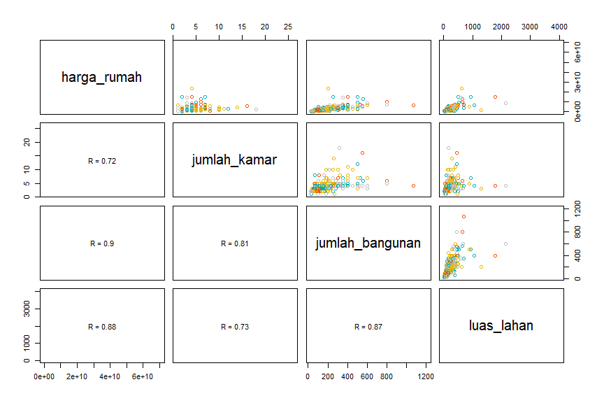
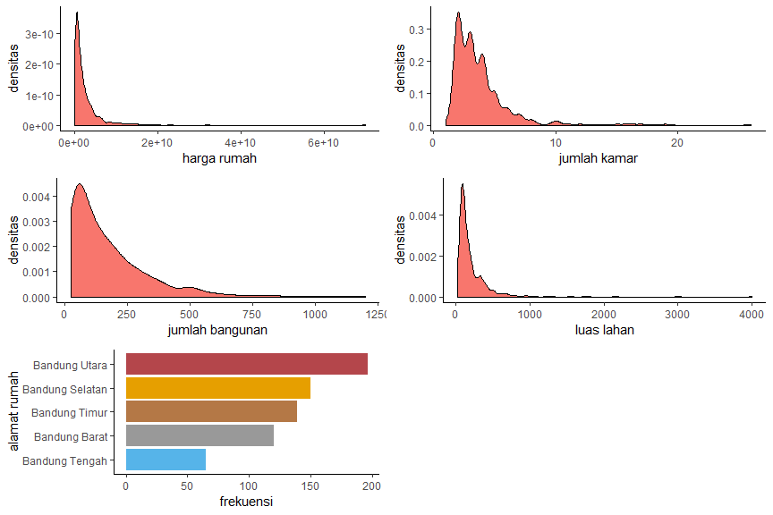
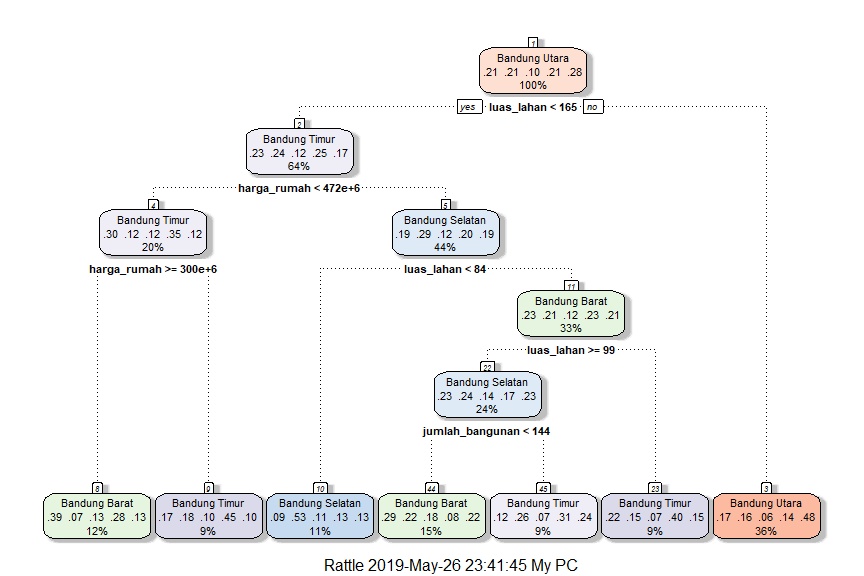
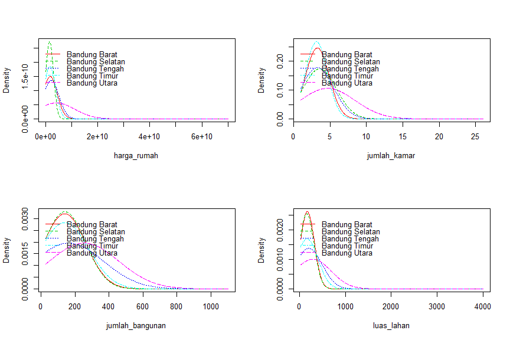

# Bussines Problems

Anda adalah seorang data analyst di perusahaan properti yang berlokasi di Kota Bandung. Pada suatu hari, anda diberikan tugas oleh atasan Anda untuk membuat sebuah model yang dapat menentukan lokasi wilayah dari suatu rumah berdasarkan nilai jual, jumlah kamar, luas tanah (LT), dan luas bangunan (LB). Anda dapat menggunakan dataset [**"003_lamudi.csv"**](https://github.com/r-academy/mlearn-capstone/raw/master/data-raw/003_lamudi.csv).

Untuk itu, 

1. Model apa yang cocok terhadap kasus diatas? Buatlah model tersebut?
2. Apa kesimpulan yang bisa diperoleh dari model yang telah dibuat?

# Aktivasi Library

Pada studi kasus ini akan digunakan sejumlah model klasifikasi, atara lain: decision tree, naive bayes, dan k-nn. Model-model tersebut memerlukan sejumlah library. Library yang digunakan dalam analisa studi kasus ini antara lain:

1. `tidyverse`: library yang berisi kumpulan fungsi untuk analisa data.
2. `skimr`: library untuk membuat ringkasan data.
3. `rpart`: library untuk membuat model decision tree.
4. `rattle`: plot model decision tree.
5. `naivebayes`: library untuk membuat model naivebayes.
6. `class`: library untuk membuat model k-nn.
7. `caret`: library untuk membuat model regresi dan klasifikasi, dalam analisa ini akan digunakan untuk membuat table confusion matrix.
8. `gridExtra`: library untuk menggabungkan beberapa plot dalam satu layar.


```r
library(tidyverse)
```

```
## Warning: package 'tidyverse' was built under R version 3.5.3
```

```
## -- Attaching packages ------------------------------------------------------ tidyverse 1.2.1 --
```

```
## v ggplot2 3.1.1     v purrr   0.3.2
## v tibble  2.1.1     v dplyr   0.8.1
## v tidyr   0.8.3     v stringr 1.4.0
## v readr   1.3.1     v forcats 0.4.0
```

```
## Warning: package 'ggplot2' was built under R version 3.5.3
```

```
## Warning: package 'tibble' was built under R version 3.5.3
```

```
## Warning: package 'tidyr' was built under R version 3.5.3
```

```
## Warning: package 'readr' was built under R version 3.5.3
```

```
## Warning: package 'purrr' was built under R version 3.5.3
```

```
## Warning: package 'dplyr' was built under R version 3.5.3
```

```
## Warning: package 'forcats' was built under R version 3.5.3
```

```
## -- Conflicts --------------------------------------------------------- tidyverse_conflicts() --
## x dplyr::filter() masks stats::filter()
## x dplyr::lag()    masks stats::lag()
```

```r
library(skimr)
```

```
## Warning: package 'skimr' was built under R version 3.5.3
```

```
## 
## Attaching package: 'skimr'
```

```
## The following object is masked from 'package:stats':
## 
##     filter
```

```r
library(rpart)
```

```
## Warning: package 'rpart' was built under R version 3.5.3
```

```r
library(naivebayes)
```

```
## Warning: package 'naivebayes' was built under R version 3.5.3
```

```r
library(class)
library(rattle)
```

```
## Warning: package 'rattle' was built under R version 3.5.3
```

```
## Rattle: A free graphical interface for data science with R.
## Version 5.2.0 Copyright (c) 2006-2018 Togaware Pty Ltd.
## Type 'rattle()' to shake, rattle, and roll your data.
```

```r
library(caret)
```

```
## Warning: package 'caret' was built under R version 3.5.3
```

```
## Loading required package: lattice
```

```
## 
## Attaching package: 'caret'
```

```
## The following object is masked from 'package:purrr':
## 
##     lift
```

```r
library(gridExtra)
```

```
## Warning: package 'gridExtra' was built under R version 3.5.3
```

```
## 
## Attaching package: 'gridExtra'
```

```
## The following object is masked from 'package:dplyr':
## 
##     combine
```

# Import Dataset

Dataset yang digunakan dalam analisa ini adalah [**"003_lamudi.csv"**](https://github.com/r-academy/mlearn-capstone/raw/master/data-raw/003_lamudi.csv). Berikut adalah sintaks untuk melakukan upload dataset.


```r
# import dataset
df <- read_csv("../data-raw/003_lamudi.csv")
```

```
## Parsed with column specification:
## cols(
##   alamat_rumah = col_character(),
##   harga_rumah = col_double(),
##   jumlah_kamar = col_double(),
##   jumlah_bangunan = col_double(),
##   luas_lahan = col_double()
## )
```

```r
head(df)
```

```
## # A tibble: 6 x 5
##   alamat_rumah    harga_rumah jumlah_kamar jumlah_bangunan luas_lahan
##   <chr>                 <dbl>        <dbl>           <dbl>      <dbl>
## 1 Bandung Selatan  2000000000            3             127        126
## 2 Bandung Utara     999000000            3              62         72
## 3 Bandung Utara    1019000000            3              66         72
## 4 Bandung Timur    1230900000            2              60         90
## 5 Bandung Selatan  1400000000            2              94         90
## 6 Bandung Utara    5200000000            4             335        589
```

```r
# cek struktur data
glimpse(df)
```

```
## Observations: 670
## Variables: 5
## $ alamat_rumah    <chr> "Bandung Selatan", "Bandung Utara", "Bandung U...
## $ harga_rumah     <dbl> 2000000000, 999000000, 1019000000, 1230900000,...
## $ jumlah_kamar    <dbl> 3, 3, 3, 2, 2, 4, 3, 2, 4, 3, 3, 2, 3, 2, 2, 2...
## $ jumlah_bangunan <dbl> 127, 62, 66, 60, 94, 335, 130, 38, 250, 70, 50...
## $ luas_lahan      <dbl> 126, 72, 72, 90, 90, 589, 111, 78, 265, 95, 13...
```

```r
# buat ringkasan data
skim(df)
```

```
## Skim summary statistics
##  n obs: 670 
##  n variables: 5 
## 
## -- Variable type:character --------------------------------------------------------------------
##      variable missing complete   n min max empty n_unique
##  alamat_rumah       0      670 670  13  15     0        5
## 
## -- Variable type:numeric ----------------------------------------------------------------------
##         variable missing complete   n      mean        sd    p0   p25
##      harga_rumah       1      669 670   2.5e+09   4.2e+09 1e+08 5e+08
##  jumlah_bangunan       1      669 670 176.8     167.91       28    55
##     jumlah_kamar       1      669 670   3.8       2.57        1     2
##       luas_lahan       1      669 670 213.59    284.3        25    78
##        p50   p75  p100     hist
##    1.3e+09 3e+09 7e+10 <U+2587><U+2581><U+2581><U+2581><U+2581><U+2581><U+2581><U+2581>
##  120         245  1200 <U+2587><U+2583><U+2581><U+2581><U+2581><U+2581><U+2581><U+2581>
##    3           4    26 <U+2587><U+2582><U+2581><U+2581><U+2581><U+2581><U+2581><U+2581>
##  130         240  4000 <U+2587><U+2581><U+2581><U+2581><U+2581><U+2581><U+2581><U+2581>
```

**Keterangan:**

+ `alamat_rumah`: lokasi kemacatan rumah berada.
+ `harga_rumah`: harga dari rumah dalam satuan rupiah.
+ `jumlah_kamar`: jumlah kamar yang dimiliki oleh rumah.
+ `jumlah_bangunan`: jumlah bangunan.
+ `luas_lahan`: luas lahan dari rumah berada dalam satu meter persegi.

# Exploratory Data Analysis

Sebelum masuk ke dalam analisa model, kita perlu melakukan analissi data eksploratif (EDA) untuk melihat distribusi dan asosiasi antar variabel pada data.

**scatterplot matrix**


```r
# membuat fungsi untuk menghitung
# nilai korelasi yang ditempatkan pada panel bawah
panel.cor <- function(x, y){
# definisi parameter grafik
  usr <- par("usr"); on.exit(par(usr))
  par(usr = c(0, 1, 0, 1))
# menghitung koefisien korelas
  r <- round(cor(x, y, use="complete.obs", 
                 method="spearman"), digits=2)
# menambahkan text berdasarkan koefisien korelasi
  txt <- paste0("R = ", r)
# mengatur besar text sesuai besarnya nilai korelasi
  text(0.5, 0.5, txt)
}
# kustomisasi panel atas agar
# warna titik berdasarkan factor
my_col <- c("#00AFBB", "#E7B800", "#FC4E07", "grey")
upper.panel<-function(x, y){
  points(x,y, col = my_col[as.factor(df$alamat_rumah)])
}

pairs(df[,-1],
  lower.panel= panel.cor,
  upper.panel= upper.panel)
```

<!-- -->

Berdasarkan hasil visualisasi dapat disimpulkan bahwa antar variabel numerik memiliki nilai korelasi yang tinggi dengan nilai koefisien korelasi Spearman > 0,7.

**Density plot dan Bar Plot**


```r
theme_set(theme_classic())

barplot<-df %>% group_by(alamat_rumah) %>% 
  summarise(frekuensi=n()) %>%
  ggplot(aes(x=reorder(alamat_rumah,frekuensi) , y=frekuensi, fill=as.factor(alamat_rumah)))+
  geom_bar(stat="identity")+
  theme(legend.position="none")+
  scale_fill_manual(values=c("#999999", "#E69F00", "#56B4E9",
"#B47846","#B4464B"))+
  coord_flip()+
  labs(x="alamat rumah", y="frekuensi")

harga <- ggplot(df, aes(harga_rumah))+
  geom_density(aes(fill="#E69F00"))+
  theme(legend.position="none")+
  labs(x="harga rumah", y="densitas")

kamar <- ggplot(df, aes(jumlah_kamar))+
  geom_density(aes(fill="red"))+
  theme(legend.position="none")+
  labs(x="jumlah kamar", y="densitas")

bangunan <- ggplot(df, aes(jumlah_bangunan))+
  geom_density(aes(fill="#56B4E9"))+
  theme(legend.position="none")+
  labs(x="jumlah bangunan", y="densitas")

lahan <- ggplot(df, aes(luas_lahan))+
  geom_density(aes(fill="#B47846"))+
  theme(legend.position="none")+
  labs(x="luas lahan", y="densitas")

grid.arrange(harga, kamar, bangunan, lahan, barplot, nrow=3)
```

<!-- -->

Berdasarkan visualisasi dapat dilihat bahwa distribusi masing-masing variabel cenderung memiliki kemencengan positif (*positively skewed*). Selain itu, dari visualisasi juga terlihat bahwa frekuensi alamat rumah tertinggi pada data terletak pada kecamatan Bandung Utara.

# Data Preprocessing

Pada tahapan ini data dilakukan proses penanganan *missing data* serta pembagian dataset menjadi datase training dan testing. Berdasarkan hasil ringkasan data diketahui bahwa jumlah data hilang pada masing-masing kolom adalah satu, sehingga diputuskan pada analisa ini baris data dengan data yang hilang akan dikecualikan.


```r
# data cleaning
df_clean <- df %>% 
  mutate_if(is.character, as.factor) %>%
  filter(!is.na(harga_rumah)==TRUE)

# ringkasan data
skim(df_clean)
```

```
## Skim summary statistics
##  n obs: 669 
##  n variables: 5 
## 
## -- Variable type:factor -----------------------------------------------------------------------
##      variable missing complete   n n_unique
##  alamat_rumah       0      669 669        5
##                              top_counts ordered
##  Ban: 196, Ban: 150, Ban: 138, Ban: 120   FALSE
## 
## -- Variable type:numeric ----------------------------------------------------------------------
##         variable missing complete   n      mean        sd    p0   p25
##      harga_rumah       0      669 669   2.5e+09   4.2e+09 1e+08 5e+08
##  jumlah_bangunan       0      669 669 176.8     167.91       28    55
##     jumlah_kamar       0      669 669   3.8       2.57        1     2
##       luas_lahan       0      669 669 213.59    284.3        25    78
##        p50   p75  p100     hist
##    1.3e+09 3e+09 7e+10 <U+2587><U+2581><U+2581><U+2581><U+2581><U+2581><U+2581><U+2581>
##  120         245  1200 <U+2587><U+2583><U+2581><U+2581><U+2581><U+2581><U+2581><U+2581>
##    3           4    26 <U+2587><U+2582><U+2581><U+2581><U+2581><U+2581><U+2581><U+2581>
##  130         240  4000 <U+2587><U+2581><U+2581><U+2581><U+2581><U+2581><U+2581><U+2581>
```

```r
# data preprocessing
set.seed(123)
#Membangi Data Ke Training dan Testing (70:30)
index_train <- sample(1:nrow(df_clean), 0.7 * nrow(df_clean))
train <- df_clean[index_train, ]
test <- df_clean[-index_train, ]
```

# Model Decision Tree

Model pertama yang akan kita gunakan adalah model decision tree. Model ini melakukan stratifikasi atau segmentasi pada ruang prediktor menjadi sejumlah bagian. Bagian-bagian tersebut selanjutnya akan dibangun kedalam bentuk pohon keputusan yang terdiri atas root, node dan branch.

## Model Building


```r
# membuat model decision tree untuk mengklasifikasikan
# alamat rumah masing-masing observasi.
tree <- rpart(alamat_rumah ~., train, method = "class")

# ringkasan model
summary(tree)
```

```
## Call:
## rpart(formula = alamat_rumah ~ ., data = train, method = "class")
##   n= 468 
## 
##           CP nsplit rel error    xerror       xstd
## 1 0.07396450      0 1.0000000 1.0000000 0.02866754
## 2 0.05621302      1 0.9260355 1.0029586 0.02859928
## 3 0.01775148      2 0.8698225 0.9408284 0.02986892
## 4 0.01479290      3 0.8520710 0.9497041 0.02970787
## 5 0.01000000      6 0.8017751 0.9289941 0.03007361
## 
## Variable importance
##      luas_lahan     harga_rumah jumlah_bangunan    jumlah_kamar 
##              35              27              26              12 
## 
## Node number 1: 468 observations,    complexity param=0.0739645
##   predicted class=Bandung Utara    expected loss=0.7222222  P(node) =1
##     class counts:    96    98    46    98   130
##    probabilities: 0.205 0.209 0.098 0.209 0.278 
##   left son=2 (301 obs) right son=3 (167 obs)
##   Primary splits:
##       luas_lahan      < 165        to the left,  improve=13.348530, (0 missing)
##       harga_rumah     < 2.125e+09  to the left,  improve=12.222250, (0 missing)
##       jumlah_bangunan < 222.5      to the left,  improve=11.504840, (0 missing)
##       jumlah_kamar    < 2.5        to the left,  improve= 7.898499, (0 missing)
##   Surrogate splits:
##       jumlah_bangunan < 198        to the left,  agree=0.885, adj=0.677, (0 split)
##       harga_rumah     < 1962500000 to the left,  agree=0.878, adj=0.659, (0 split)
##       jumlah_kamar    < 3.5        to the left,  agree=0.797, adj=0.431, (0 split)
## 
## Node number 2: 301 observations,    complexity param=0.05621302
##   predicted class=Bandung Timur    expected loss=0.7508306  P(node) =0.6431624
##     class counts:    68    72    36    75    50
##    probabilities: 0.226 0.239 0.120 0.249 0.166 
##   left son=4 (94 obs) right son=5 (207 obs)
##   Primary splits:
##       harga_rumah     < 472500000  to the left,  improve=4.497716, (0 missing)
##       luas_lahan      < 103.5      to the left,  improve=2.198137, (0 missing)
##       jumlah_bangunan < 41         to the left,  improve=2.152208, (0 missing)
##       jumlah_kamar    < 2.5        to the left,  improve=1.491058, (0 missing)
##   Surrogate splits:
##       jumlah_bangunan < 41         to the left,  agree=0.910, adj=0.713, (0 split)
##       luas_lahan      < 74.5       to the left,  agree=0.811, adj=0.394, (0 split)
##       jumlah_kamar    < 2.5        to the left,  agree=0.734, adj=0.149, (0 split)
## 
## Node number 3: 167 observations
##   predicted class=Bandung Utara    expected loss=0.5209581  P(node) =0.3568376
##     class counts:    28    26    10    23    80
##    probabilities: 0.168 0.156 0.060 0.138 0.479 
## 
## Node number 4: 94 observations,    complexity param=0.01775148
##   predicted class=Bandung Timur    expected loss=0.6489362  P(node) =0.2008547
##     class counts:    28    11    11    33    11
##    probabilities: 0.298 0.117 0.117 0.351 0.117 
##   left son=8 (54 obs) right son=9 (40 obs)
##   Primary splits:
##       harga_rumah     < 299500000  to the right, improve=2.00721000, (0 missing)
##       luas_lahan      < 61.5       to the right, improve=1.78478600, (0 missing)
##       jumlah_bangunan < 66         to the right, improve=0.91044040, (0 missing)
##       jumlah_kamar    < 2.5        to the right, improve=0.08133113, (0 missing)
##   Surrogate splits:
##       jumlah_bangunan < 34.5       to the right, agree=0.777, adj=0.475, (0 split)
##       luas_lahan      < 60.5       to the right, agree=0.766, adj=0.450, (0 split)
## 
## Node number 5: 207 observations,    complexity param=0.0147929
##   predicted class=Bandung Selatan  expected loss=0.705314  P(node) =0.4423077
##     class counts:    40    61    25    42    39
##    probabilities: 0.193 0.295 0.121 0.203 0.188 
##   left son=10 (53 obs) right son=11 (154 obs)
##   Primary splits:
##       luas_lahan      < 83.5       to the left,  improve=5.172276, (0 missing)
##       jumlah_kamar    < 2.5        to the left,  improve=3.898551, (0 missing)
##       jumlah_bangunan < 47         to the left,  improve=3.881969, (0 missing)
##       harga_rumah     < 481500000  to the left,  improve=3.603233, (0 missing)
##   Surrogate splits:
##       jumlah_bangunan < 47         to the left,  agree=0.836, adj=0.358, (0 split)
##       harga_rumah     < 4.97e+08   to the left,  agree=0.816, adj=0.283, (0 split)
##       jumlah_kamar    < 2.5        to the left,  agree=0.787, adj=0.170, (0 split)
## 
## Node number 8: 54 observations
##   predicted class=Bandung Barat    expected loss=0.6111111  P(node) =0.1153846
##     class counts:    21     4     7    15     7
##    probabilities: 0.389 0.074 0.130 0.278 0.130 
## 
## Node number 9: 40 observations
##   predicted class=Bandung Timur    expected loss=0.55  P(node) =0.08547009
##     class counts:     7     7     4    18     4
##    probabilities: 0.175 0.175 0.100 0.450 0.100 
## 
## Node number 10: 53 observations
##   predicted class=Bandung Selatan  expected loss=0.4716981  P(node) =0.1132479
##     class counts:     5    28     6     7     7
##    probabilities: 0.094 0.528 0.113 0.132 0.132 
## 
## Node number 11: 154 observations,    complexity param=0.0147929
##   predicted class=Bandung Barat    expected loss=0.7727273  P(node) =0.3290598
##     class counts:    35    33    19    35    32
##    probabilities: 0.227 0.214 0.123 0.227 0.208 
##   left son=22 (114 obs) right son=23 (40 obs)
##   Primary splits:
##       luas_lahan      < 99         to the right, improve=2.142641, (0 missing)
##       jumlah_bangunan < 144        to the left,  improve=1.357023, (0 missing)
##       jumlah_kamar    < 2.5        to the right, improve=1.160383, (0 missing)
##       harga_rumah     < 8.55e+08   to the left,  improve=1.014362, (0 missing)
##   Surrogate splits:
##       harga_rumah     < 5.9e+08    to the right, agree=0.773, adj=0.125, (0 split)
##       jumlah_bangunan < 47         to the right, agree=0.747, adj=0.025, (0 split)
## 
## Node number 22: 114 observations,    complexity param=0.0147929
##   predicted class=Bandung Selatan  expected loss=0.7631579  P(node) =0.2435897
##     class counts:    26    27    16    19    26
##    probabilities: 0.228 0.237 0.140 0.167 0.228 
##   left son=44 (72 obs) right son=45 (42 obs)
##   Primary splits:
##       jumlah_bangunan < 144        to the left,  improve=2.511905, (0 missing)
##       jumlah_kamar    < 4.5        to the left,  improve=1.751515, (0 missing)
##       luas_lahan      < 100.5      to the right, improve=1.539683, (0 missing)
##       harga_rumah     < 874500000  to the left,  improve=1.193030, (0 missing)
##   Surrogate splits:
##       harga_rumah  < 1649500000 to the left,  agree=0.754, adj=0.333, (0 split)
##       jumlah_kamar < 3.5        to the left,  agree=0.728, adj=0.262, (0 split)
##       luas_lahan   < 151.5      to the left,  agree=0.658, adj=0.071, (0 split)
## 
## Node number 23: 40 observations
##   predicted class=Bandung Timur    expected loss=0.6  P(node) =0.08547009
##     class counts:     9     6     3    16     6
##    probabilities: 0.225 0.150 0.075 0.400 0.150 
## 
## Node number 44: 72 observations
##   predicted class=Bandung Barat    expected loss=0.7083333  P(node) =0.1538462
##     class counts:    21    16    13     6    16
##    probabilities: 0.292 0.222 0.181 0.083 0.222 
## 
## Node number 45: 42 observations
##   predicted class=Bandung Timur    expected loss=0.6904762  P(node) =0.08974359
##     class counts:     5    11     3    13    10
##    probabilities: 0.119 0.262 0.071 0.310 0.238
```

```r
# plot decision tree
fancyRpartPlot(tree)
```

<!-- -->

Cara membaca model yang terbangun sama dengan nama model itu sendiri yaitu pohon keputusan (melibatkan logika jika...maka..), misal: jika luas lahan < 165 $m^2$, dan harga rumah > Rp. 472.000.000,-, serta luas lahan < 84 $m^2$, maka rumah tersebut berada di Kecamatan Bandung Selatan.

## Model Validation

Validasi model akan dilakukan dengan membangun confusion matriks serta menghitung nilai akurasi dari model yang akan digunakan sebagai pembanding model mana yang akan digunakan untuk menjelaskan studi kasus ini.


```r
#Prediksi Pada Data Testing
pred_dt <- predict(tree, test, type = "class")
```


```r
#Validasi Menggunakan Confussion Matrix
conf <- table(test$alamat_rumah, pred_dt)
conf
```

```
##                  pred_dt
##                   Bandung Barat Bandung Selatan Bandung Tengah
##   Bandung Barat              10               3              0
##   Bandung Selatan             9               9              0
##   Bandung Tengah              9               4              0
##   Bandung Timur               7               6              0
##   Bandung Utara              10               4              0
##                  pred_dt
##                   Bandung Timur Bandung Utara
##   Bandung Barat               7             4
##   Bandung Selatan            11            23
##   Bandung Tengah              3             3
##   Bandung Timur               8            19
##   Bandung Utara               9            43
```

```r
#confusion matrix lengkap
confusionMatrix(pred_dt, test$alamat_rumah)
```

```
## Confusion Matrix and Statistics
## 
##                  Reference
## Prediction        Bandung Barat Bandung Selatan Bandung Tengah
##   Bandung Barat              10               9              9
##   Bandung Selatan             3               9              4
##   Bandung Tengah              0               0              0
##   Bandung Timur               7              11              3
##   Bandung Utara               4              23              3
##                  Reference
## Prediction        Bandung Timur Bandung Utara
##   Bandung Barat               7            10
##   Bandung Selatan             6             4
##   Bandung Tengah              0             0
##   Bandung Timur               8             9
##   Bandung Utara              19            43
## 
## Overall Statistics
##                                           
##                Accuracy : 0.3483          
##                  95% CI : (0.2826, 0.4185)
##     No Information Rate : 0.3284          
##     P-Value [Acc > NIR] : 0.2974          
##                                           
##                   Kappa : 0.1332          
##                                           
##  Mcnemar's Test P-Value : 5.006e-06       
## 
## Statistics by Class:
## 
##                      Class: Bandung Barat Class: Bandung Selatan
## Sensitivity                       0.41667                0.17308
## Specificity                       0.80226                0.88591
## Pos Pred Value                    0.22222                0.34615
## Neg Pred Value                    0.91026                0.75429
## Prevalence                        0.11940                0.25871
## Detection Rate                    0.04975                0.04478
## Detection Prevalence              0.22388                0.12935
## Balanced Accuracy                 0.60946                0.52949
##                      Class: Bandung Tengah Class: Bandung Timur
## Sensitivity                        0.00000               0.2000
## Specificity                        1.00000               0.8137
## Pos Pred Value                         NaN               0.2105
## Neg Pred Value                     0.90547               0.8037
## Prevalence                         0.09453               0.1990
## Detection Rate                     0.00000               0.0398
## Detection Prevalence               0.00000               0.1891
## Balanced Accuracy                  0.50000               0.5068
##                      Class: Bandung Utara
## Sensitivity                        0.6515
## Specificity                        0.6370
## Pos Pred Value                     0.4674
## Neg Pred Value                     0.7890
## Prevalence                         0.3284
## Detection Rate                     0.2139
## Detection Prevalence               0.4577
## Balanced Accuracy                  0.6443
```

Akurasi juga dapat dihitung menggunakan cara berikut:


```r
# menghitung nilai akurasi
acct <- mean(pred_dt==test$alamat_rumah)
acct
```

```
## [1] 0.3482587
```

Berdasarkan hasil yang diperoleh diketahui akurasi model (model tepat dalam melakukan klasifikasi data) sebesar 34,8%.

# Model Naive Bayes

Model Naive Bayes merupakan model yang di dasarkan pada teorema bayes. Model ini merupakan model klasifikasi yang mudah untuk dibuat dan dilakukan interpretasi.

## Model Building


```r
#Membuat model prediksi Naive Bayes
nb <- naive_bayes(alamat_rumah ~ ., data = train)

#Melihat model yang telah dibuat 
nb
```

```
## ================================ Naive Bayes ================================= 
## Call: 
## naive_bayes.formula(formula = alamat_rumah ~ ., data = train)
## 
## A priori probabilities: 
## 
##   Bandung Barat Bandung Selatan  Bandung Tengah   Bandung Timur 
##       0.2051282       0.2094017       0.0982906       0.2094017 
##   Bandung Utara 
##       0.2777778 
## 
## Tables: 
##            
## harga_rumah Bandung Barat Bandung Selatan Bandung Tengah Bandung Timur
##        mean    1803412917      1564910867     2160250000    1677993327
##        sd      2667549901      1467279323     2933829922    2151788983
##            
## harga_rumah Bandung Utara
##        mean    4153399555
##        sd      7126393779
## 
##             
## jumlah_kamar Bandung Barat Bandung Selatan Bandung Tengah Bandung Timur
##         mean      3.270833        3.581633       3.282609      3.153061
##         sd        1.618831        2.292630       2.237688      1.487765
##             
## jumlah_kamar Bandung Utara
##         mean      4.676923
##         sd        3.760701
## 
##                
## jumlah_bangunan Bandung Barat Bandung Selatan Bandung Tengah Bandung Timur
##            mean      139.3229        139.8673       162.9348      139.2449
##            sd        124.3418        121.0797       203.9015      140.9308
##                
## jumlah_bangunan Bandung Utara
##            mean      253.3615
##            sd        203.9293
## 
##           
## luas_lahan Bandung Barat Bandung Selatan Bandung Tengah Bandung Timur
##       mean      168.5000        155.7551       198.8696      163.2449
##       sd        152.5115        156.8036       290.2528      235.7301
##           
## luas_lahan Bandung Utara
##       mean      286.7000
##       sd        396.0508
```

```r
#Visualisasi Model
par(mfrow=c(2,2))
plot(nb)
```

<!-- -->

Pada hasil yang diperoleh untuk jenis data factor `R`, fungsi tersebut menghasilkan luaran probabilitas dari masing-masing factor. Untuk jenis data numerik, fungsi tersebut menghasilkan tabulasi nilai rata-rata dan simpangan baku pada masing-masing factor.

Berdasrkan visualisasi yang dihasilkan dapat dilihat juga distribusi seluruh variabel cenderung memiliki kemencengan yang positif. Densitas tertinggi dari masing-masing variabel dimiliki oleh factor Bandung Barat. Hal ini telah sesuai dengan hasil yang diperoleh dari hasil EDA.

## Model Validation

Validasi model dilakukan melalui pengecekan nilai akurasi, specificity, sensitifity, dan presisi menggunaka  confusion matriks. Sama seperti model sebelumnya, pada analisa ini nilai akurasi akan dijadikan penentu dalam pemilihan model yang cocok.


```r
#Melakukan prediksi dengan data testing
pred_nb <- predict(nb, as.data.frame(test))

# validation
#Membuat Confussion Matrix Naive Bayes
confnb <- table(test$alamat_rumah, pred_nb)
confnb
```

```
##                  pred_nb
##                   Bandung Barat Bandung Selatan Bandung Tengah
##   Bandung Barat               1              21              0
##   Bandung Selatan             3              41              0
##   Bandung Tengah              0              18              0
##   Bandung Timur               4              29              0
##   Bandung Utara               6              34              0
##                  pred_nb
##                   Bandung Timur Bandung Utara
##   Bandung Barat               0             2
##   Bandung Selatan             2             6
##   Bandung Tengah              0             1
##   Bandung Timur               2             5
##   Bandung Utara               1            25
```

```r
#confusion matrix lengkap
confusionMatrix(pred_nb, test$alamat_rumah)
```

```
## Confusion Matrix and Statistics
## 
##                  Reference
## Prediction        Bandung Barat Bandung Selatan Bandung Tengah
##   Bandung Barat               1               3              0
##   Bandung Selatan            21              41             18
##   Bandung Tengah              0               0              0
##   Bandung Timur               0               2              0
##   Bandung Utara               2               6              1
##                  Reference
## Prediction        Bandung Timur Bandung Utara
##   Bandung Barat               4             6
##   Bandung Selatan            29            34
##   Bandung Tengah              0             0
##   Bandung Timur               2             1
##   Bandung Utara               5            25
## 
## Overall Statistics
##                                           
##                Accuracy : 0.3433          
##                  95% CI : (0.2779, 0.4134)
##     No Information Rate : 0.3284          
##     P-Value [Acc > NIR] : 0.351           
##                                           
##                   Kappa : 0.1113          
##                                           
##  Mcnemar's Test P-Value : NA              
## 
## Statistics by Class:
## 
##                      Class: Bandung Barat Class: Bandung Selatan
## Sensitivity                      0.041667                 0.7885
## Specificity                      0.926554                 0.3154
## Pos Pred Value                   0.071429                 0.2867
## Neg Pred Value                   0.877005                 0.8103
## Prevalence                       0.119403                 0.2587
## Detection Rate                   0.004975                 0.2040
## Detection Prevalence             0.069652                 0.7114
## Balanced Accuracy                0.484110                 0.5519
##                      Class: Bandung Tengah Class: Bandung Timur
## Sensitivity                        0.00000              0.05000
## Specificity                        1.00000              0.98137
## Pos Pred Value                         NaN              0.40000
## Neg Pred Value                     0.90547              0.80612
## Prevalence                         0.09453              0.19900
## Detection Rate                     0.00000              0.00995
## Detection Prevalence               0.00000              0.02488
## Balanced Accuracy                  0.50000              0.51568
##                      Class: Bandung Utara
## Sensitivity                        0.3788
## Specificity                        0.8963
## Pos Pred Value                     0.6410
## Neg Pred Value                     0.7469
## Prevalence                         0.3284
## Detection Rate                     0.1244
## Detection Prevalence               0.1940
## Balanced Accuracy                  0.6375
```

Nilai akurasi yang diperoleh tidak berbeda jauh dengan model decision tree yaitu sebesar 34,3%. Akurasi juga dapat dihitung menggunakan cara berikut:


```r
# akurasi
accnb <- mean(pred_nb==test$alamat_rumah)
accnb
```

```
## [1] 0.3432836
```

# Model K-NN

Model K-NN merupakan salah satu model klasifikasi yang populer. Algoritma K-NN bergantung pada "kedekatan" antara training sample dengan tetangganya (test sample). Jauh dekatnya jarak antar tetangga biasanya dihitung berdasarkan jarak *Euclidian*. Namun untuk kasus tertentu dapat pula dihitung menggunakan metode lain seperti Manhattan, Minkowski, dsb.

## Data Preprocessing

Normalisasi (membuat range data menjadi 0 sampai 1) atau standarisasi (menseragamkan simpangan baku dan mean) perlu dilakukan dalam pembangunan model ini sebab algoritma yang digunakan adalah algoritma jarak. Dalam model kali ini dataset akan dilakukan standarisasi sebab distribusi dataset yang memilikik kemencengan positif (terdapat outlier). 

Proses lain yang perlu dilakukan adalah merubah seluruh jenis data menjadi numerik. Berikut adalah sintaks untuk melakukannya:


```r
# Data preprocessing
df_clean <- mutate_if(df_clean, is.factor, as.numeric)

# print
df_clean
```

```
## # A tibble: 669 x 5
##    alamat_rumah harga_rumah jumlah_kamar jumlah_bangunan luas_lahan
##           <dbl>       <dbl>        <dbl>           <dbl>      <dbl>
##  1            2  2000000000            3             127        126
##  2            5   999000000            3              62         72
##  3            5  1019000000            3              66         72
##  4            4  1230900000            2              60         90
##  5            2  1400000000            2              94         90
##  6            5  5200000000            4             335        589
##  7            5  1140750000            3             130        111
##  8            1   200000000            2              38         78
##  9            5  4501000000            4             250        265
## 10            3   875425000            3              70         95
## # ... with 659 more rows
```

Berdasarkan hasil yang diperoleh, kolom `alamat_rumah` telah dikonversi menjadi numerik dengan perubahan sebagai berikut:

- 1 = Bandung Barat
- 2 = Bandung Selatan
- 3 = Bandung Tengah
- 4 = Bandung Timur
- 5 = Bandung Utara

Berikut adalah proses standarisasi yang dilakukan:


```r
# standarisasi
df_norm<-as.data.frame(lapply(df_clean[,-1],scale))
df_norm2<-bind_cols(df_clean[,1],df_norm)

# ringkasan data
skim(df_norm2)
```

```
## Skim summary statistics
##  n obs: 669 
##  n variables: 5 
## 
## -- Variable type:numeric ----------------------------------------------------------------------
##         variable missing complete   n     mean   sd    p0   p25   p50
##     alamat_rumah       0      669 669  3.21    1.51  1     2     3   
##      harga_rumah       0      669 669 -4.8e-17 1    -0.58 -0.48 -0.29
##  jumlah_bangunan       0      669 669  1.7e-17 1    -0.89 -0.73 -0.34
##     jumlah_kamar       0      669 669 -6.8e-17 1    -1.09 -0.7  -0.31
##       luas_lahan       0      669 669 -2.4e-17 1    -0.66 -0.48 -0.29
##    p75  p100     hist
##  5      5    <U+2585><U+2586><U+2581><U+2582><U+2581><U+2586><U+2581><U+2587>
##  0.11  15.93 <U+2587><U+2581><U+2581><U+2581><U+2581><U+2581><U+2581><U+2581>
##  0.41   6.09 <U+2587><U+2583><U+2581><U+2581><U+2581><U+2581><U+2581><U+2581>
##  0.078  8.62 <U+2587><U+2582><U+2581><U+2581><U+2581><U+2581><U+2581><U+2581>
##  0.093 13.32 <U+2587><U+2581><U+2581><U+2581><U+2581><U+2581><U+2581><U+2581>
```

Langkah selanjutnya yang perlu dilakukan adalah membagi data menajdi data training dan testing. Berikut adalah sintaks untuk melakukannya:


```r
#Membagi ke Data Train dan Data Testing
index_train <- sample(1:nrow(df_norm2), 0.7 * nrow(df_norm2))
df_norm2_train <- df_norm2[index_train, -1]
df_norm2_test <- df_norm2[-index_train, -1]

#Mengambil Label
df_norm2_train_target<-df_norm2[index_train ,1]
df_norm2_test_target<-df_norm2[-index_train ,1]
```

## Model Building


```r
#Membuat KNN-Model dengan Nilai K=2
knnmodel <-knn(train=df_norm2_train,test=df_norm2_test,
               cl=as.matrix(df_norm2_train_target,k=2))

knnmodel
```

```
##   [1] 5 5 5 5 2 2 4 1 2 4 1 4 2 5 2 3 5 5 5 1 1 3 4 4 2 2 2 3 4 1 5 2 1 4 4
##  [36] 4 2 3 1 1 1 1 3 1 4 2 2 5 5 4 5 5 2 4 5 5 2 2 5 2 1 4 5 3 2 2 5 2 2 5
##  [71] 3 5 3 2 1 3 5 1 5 5 4 3 5 5 4 4 4 4 2 5 5 5 3 5 1 4 5 5 4 2 2 2 4 5 5
## [106] 5 1 2 5 2 5 5 1 1 5 4 2 1 2 1 5 3 1 2 2 4 2 5 2 5 2 3 2 4 2 1 3 5 5 5
## [141] 4 5 4 1 5 5 1 5 2 1 3 2 4 2 5 4 2 4 5 2 5 2 3 3 1 2 3 4 4 2 2 1 2 5 1
## [176] 3 5 1 2 2 5 1 1 2 2 4 4 1 4 2 2 2 2 1 1 2 5 5 2 2 3
## Levels: 1 2 3 4 5
```

## Model Validation


```r
#Validasi Menggunakan Confussion Matrix
confknn <- table(df_norm2_test_target$alamat_rumah, knnmodel)
confknn
```

```
##    knnmodel
##      1  2  3  4  5
##   1  8  9  4  8 13
##   2  8 16  3  8  6
##   3  4  4  5  2  6
##   4  7 14  4  4  9
##   5  7 14  4 12 22
```

```r
#confusion matrix lengkap
confusionMatrix(knnmodel, 
                as.factor(df_norm2_test_target$alamat_rumah))
```

```
## Confusion Matrix and Statistics
## 
##           Reference
## Prediction  1  2  3  4  5
##          1  8  8  4  7  7
##          2  9 16  4 14 14
##          3  4  3  5  4  4
##          4  8  8  2  4 12
##          5 13  6  6  9 22
## 
## Overall Statistics
##                                           
##                Accuracy : 0.2736          
##                  95% CI : (0.2133, 0.3408)
##     No Information Rate : 0.2935          
##     P-Value [Acc > NIR] : 0.7553          
##                                           
##                   Kappa : 0.0719          
##                                           
##  Mcnemar's Test P-Value : 0.5898          
## 
## Statistics by Class:
## 
##                      Class: 1 Class: 2 Class: 3 Class: 4 Class: 5
## Sensitivity            0.1905   0.3902  0.23810   0.1053   0.3729
## Specificity            0.8365   0.7438  0.91667   0.8160   0.7606
## Pos Pred Value         0.2353   0.2807  0.25000   0.1176   0.3929
## Neg Pred Value         0.7964   0.8264  0.91160   0.7964   0.7448
## Prevalence             0.2090   0.2040  0.10448   0.1891   0.2935
## Detection Rate         0.0398   0.0796  0.02488   0.0199   0.1095
## Detection Prevalence   0.1692   0.2836  0.09950   0.1692   0.2786
## Balanced Accuracy      0.5135   0.5670  0.57738   0.4606   0.5667
```

```r
# akurasi
acck <- mean(knnmodel==df_norm2_test_target$alamat_rumah)
acck
```

```
## [1] 0.2736318
```

## Penentuan Nilai K Maksimum

Nilai k akan menentukan akurasi dari model yang kita buat. Nilai k kecil akan membuat model lebih sensitif dibandingkan nilai yang lebih besar. Pada bagian ini penulis akan melakukan perhitungan nilai akurasi untuk berbagai variasi nilai k.


```r
acc <- seq(1:10)
for(i in 1:10){
    knnmodel <- knn(train=df_norm2_train,test=df_norm2_test,
               cl=as.matrix(df_norm2_train_target,k=2))
    confknn <- table(df_norm2_test_target$alamat_rumah, knnmodel)
    acc[i] <- mean(knnmodel==df_norm2_test_target$alamat_rumah)
}

acc
```

```
##  [1] 0.2636816 0.2736318 0.2686567 0.2736318 0.2786070 0.2736318 0.2686567
##  [8] 0.2736318 0.2736318 0.2786070
```

```r
# menentukan k dengan akurasi terbesar
which.max(acc)
```

```
## [1] 5
```

Berdasarkan hasil analisa diperoleh nilai k terbesar adalah k=6. Berikut adalah model yang dibangun dengan k=6:


```r
#Membuat KNN-Model dengan Nilai K=6
knnmodel <-knn(train=df_norm2_train,test=df_norm2_test,
               cl=as.matrix(df_norm2_train_target,k=6))

#Validasi Menggunakan Confussion Matrix
confknn <- table(df_norm2_test_target$alamat_rumah, knnmodel)
confknn
```

```
##    knnmodel
##      1  2  3  4  5
##   1  9  9  4  7 13
##   2  9 15  4  7  6
##   3  4  4  5  2  6
##   4  7 12  5  4 10
##   5  7 14  4 12 22
```

```r
#confusion matrix lengkap
confusionMatrix(knnmodel, 
                as.factor(df_norm2_test_target$alamat_rumah))
```

```
## Confusion Matrix and Statistics
## 
##           Reference
## Prediction  1  2  3  4  5
##          1  9  9  4  7  7
##          2  9 15  4 12 14
##          3  4  4  5  5  4
##          4  7  7  2  4 12
##          5 13  6  6 10 22
## 
## Overall Statistics
##                                           
##                Accuracy : 0.2736          
##                  95% CI : (0.2133, 0.3408)
##     No Information Rate : 0.2935          
##     P-Value [Acc > NIR] : 0.7553          
##                                           
##                   Kappa : 0.0723          
##                                           
##  Mcnemar's Test P-Value : 0.6109          
## 
## Statistics by Class:
## 
##                      Class: 1 Class: 2 Class: 3 Class: 4 Class: 5
## Sensitivity           0.21429  0.36585  0.23810   0.1053   0.3729
## Specificity           0.83019  0.75625  0.90556   0.8282   0.7535
## Pos Pred Value        0.25000  0.27778  0.22727   0.1250   0.3860
## Neg Pred Value        0.80000  0.82313  0.91061   0.7988   0.7431
## Prevalence            0.20896  0.20398  0.10448   0.1891   0.2935
## Detection Rate        0.04478  0.07463  0.02488   0.0199   0.1095
## Detection Prevalence  0.17910  0.26866  0.10945   0.1592   0.2836
## Balanced Accuracy     0.52224  0.56105  0.57183   0.4667   0.5632
```

```r
# akurasi
acck <- mean(knnmodel==df_norm2_test_target$alamat_rumah)
acck
```

```
## [1] 0.2736318
```

# Penentuan Model Terbaik

Penulis akan menggunakan nilai akurasi masing-masing model untuk menentukan model terbaik yang akan digunakan. Berikut adalah nilai akurasi masing-masing model:


```r
acct # decision tree
```

```
## [1] 0.3482587
```

```r
accnb # naive bayes
```

```
## [1] 0.3432836
```

```r
acck # k-nn
```

```
## [1] 0.2736318
```

Berdasarkan hasil yang diperoleh, nilai akurasi tertinggi dimiliki oleh model decision tree, sehingga decision tree akan dipilih sebagai model yang digunakan untuk melakukan klasifikasi lokasi rumah pada studi kasus ini.

Jika kita melihat kembali grafik yang dihasilkan dari decision tree seperti di bawah ini:


```r
fancyRpartPlot(tree)
```

<!-- -->

Berdasarkan visualisasi tersebut dapat diperoleh informasi sebagai berikut:

1. Bandung Utara memiliki hunian dengan luas lahan > 165 $m^2$. 
2. Bandung Timur memiliki rumah dengan luas lahan $\ge9$ $m^2$ atau luas luas lahan $\ge9$ $m^2$ dan jumlah bangunan $\ge144$ buah atau harga rumah diatas 300 juta rupiah. 
3. Rumah di Bandung Selatan memiliki luas lahan < 85 $m^2$ dan harga rumah yang lebih kecil dari 470 juta rupiah.
4. Bandung Barat memiliki rumah dengan harga $\ge300$ juta atau memiliki luas lahan $\ge99$ $m^2$ dan jumlah bangunan < 144 buah.

Model yang dihasilkan tidak cukup baik digunakan untuk menjelaskan rumah yang berlokasi di Bandung Tengah. Hal ini juga terjadi pada dua model lainnya, sehingga masih diperlukan model klasifikasi lain untuk dapat melakukan klasifikasi dengan lebih baik lagi.


