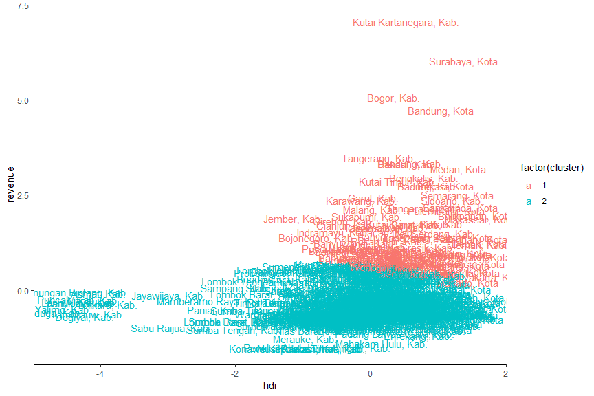

# Bussines Problems

Anda adalah seorang yang bekerja di Kementerian Sosial RI. Salah satu tugas dari Kementerian ini adalah menjamin kesejahteraan sosial bagi masyarakat. Dalam prosesnya, anda diminta untuk menganalisis Kota dan Kabupaten yang ada di seluruh Indonesia berdasarkan nilai HDI dan Revenue nya agar bisa melihat Kota dan Kabupaten mana saja yang memiliki kesamaan karakteristik terkait 2 nilai tersebut. Anda dapat menggunakan dataset [**"004_hdi.csv"**](https://github.com/r-academy/mlearn-capstone/raw/master/data-raw/004_hdi.csv).

Untuk itu,

1. Model apa yang cocok untuk kasus diatas?
2. Apakah terdapat suatu Gap yang cukup besar antara Kota dan Kabupaten di Indonesia? Jika ada, sebutkan contoh Kota dan Kabupaten tersebut?

# Aktivasli Library

Sebelum analisa dilakukan, seluruh library yang diperlukan perlu diaktivasi terlebih dahulu. Library yang dibutuhkan antara lain:

1. `tidyverse`: library yang berisi kumpulan tools data science.
2. `cluster`: library yang digunakan untuk melakukan analisis kluster.
3. `factoextra`: library yang digunakan untuk mengekstrak dan memvisualisasikan hasil dari analisis multivariat. Library ini akan digunakan untuk visualisasi kluster dan menentukan jumlah kluster optimum.
4. `skimr`: library yang digunakan untuk membuat ringkasan data.
5. `gridExtra`: library yang digunakan untuk menggabungkan beberapa grafik menjadi satu.


```r
library(tidyverse)
```

```
## Warning: package 'tidyverse' was built under R version 3.5.3
```

```
## -- Attaching packages ----------------------------------------------- tidyverse 1.2.1 --
```

```
## v ggplot2 3.1.1     v purrr   0.3.2
## v tibble  2.1.1     v dplyr   0.8.1
## v tidyr   0.8.3     v stringr 1.4.0
## v readr   1.3.1     v forcats 0.4.0
```

```
## Warning: package 'ggplot2' was built under R version 3.5.3
```

```
## Warning: package 'tibble' was built under R version 3.5.3
```

```
## Warning: package 'tidyr' was built under R version 3.5.3
```

```
## Warning: package 'readr' was built under R version 3.5.3
```

```
## Warning: package 'purrr' was built under R version 3.5.3
```

```
## Warning: package 'dplyr' was built under R version 3.5.3
```

```
## Warning: package 'forcats' was built under R version 3.5.3
```

```
## -- Conflicts -------------------------------------------------- tidyverse_conflicts() --
## x dplyr::filter() masks stats::filter()
## x dplyr::lag()    masks stats::lag()
```

```r
library(cluster)
library(factoextra)
```

```
## Warning: package 'factoextra' was built under R version 3.5.3
```

```
## Welcome! Related Books: `Practical Guide To Cluster Analysis in R` at https://goo.gl/13EFCZ
```

```r
library(skimr)
```

```
## Warning: package 'skimr' was built under R version 3.5.3
```

```
## 
## Attaching package: 'skimr'
```

```
## The following object is masked from 'package:stats':
## 
##     filter
```

```r
library(gridExtra)
```

```
## Warning: package 'gridExtra' was built under R version 3.5.3
```

```
## 
## Attaching package: 'gridExtra'
```

```
## The following object is masked from 'package:dplyr':
## 
##     combine
```

# Import Data

Dataset yang digunakan adalah dataset *human development index* kota dan kabupaten di Indonesia yang dapat diunduh pada tautan berikut:([**"004_hdi.csv"**](https://github.com/r-academy/mlearn-capstone/raw/master/data-raw/004_hdi.csv)).


```r
# import data
df <- read_csv("../data-raw/004_hdi.csv")
```

```
## Parsed with column specification:
## cols(
##   kota = col_character(),
##   id = col_character(),
##   hdi = col_double(),
##   revenue = col_double()
## )
```

```r
df
```

```
## # A tibble: 468 x 4
##    kota                 id                              hdi       revenue
##    <chr>                <chr>                         <dbl>         <dbl>
##  1 Ambon, Kota          IDN_Ambon_Kota_18139           79.6  848613000000
##  2 Balikpapan, Kota     IDN_Balikpapan_Kota_18130      79.9 2422210000000
##  3 Banda Aceh, Kota     IDN_Banda_Aceh_Kota_73705      79    928241000000
##  4 Bandar Lampung, Kota IDN_Bandar_Lampung_Kota_18134  77.2 1688410000000
##  5 Bandung, Kota        IDN_Bandung_Kota_18015         77.3 4332090000000
##  6 Banjar, Kota         IDN_Banjar_Kota_73707          72.8  620917000000
##  7 Banjarbaru, Kota     IDN_Banjarbaru_Kota_73706      76.9  747567000000
##  8 Banjarmasin, Kota    IDN_Banjarmasin_Kota_18113     75.3 1285110000000
##  9 Batam, Kota          IDN_Batam_Kota_73708           78.7 1749110000000
## 10 Batu, Kota           IDN_Batu_Kota_73709            76.1  553618000000
## # ... with 458 more rows
```

```r
# cek struktur data
glimpse(df)
```

```
## Observations: 468
## Variables: 4
## $ kota    <chr> "Ambon, Kota", "Balikpapan, Kota", "Banda Aceh, Kota",...
## $ id      <chr> "IDN_Ambon_Kota_18139", "IDN_Balikpapan_Kota_18130", "...
## $ hdi     <dbl> 79.58, 79.87, 79.00, 77.17, 77.32, 72.84, 76.86, 75.28...
## $ revenue <dbl> 8.48613e+11, 2.42221e+12, 9.28241e+11, 1.68841e+12, 4....
```

```r
# buat ringkasan data
skim(df)
```

```
## Skim summary statistics
##  n obs: 468 
##  n variables: 4 
## 
## -- Variable type:character -------------------------------------------------------------
##  variable missing complete   n min max empty n_unique
##        id       0      468 468  14  40     0      468
##      kota       0      468 468  10  33     0      468
## 
## -- Variable type:numeric ---------------------------------------------------------------
##  variable missing complete   n     mean      sd       p0      p25      p50
##       hdi       0      468 468 72.23    4.92       49.29 70.29    72.68   
##   revenue       0      468 468  1.1e+12 6.9e+11 5e+09     6.2e+11  8.5e+11
##       p75     p100     hist
##  75.06       80.51 <U+2581><U+2581><U+2581><U+2581><U+2582><U+2587><U+2587><U+2583>
##   1.3e+12 6e+12    <U+2587><U+2587><U+2582><U+2581><U+2581><U+2581><U+2581><U+2581>
```

**Keterangan:**

+ `kota`: nama kota atau kabupaten.
+ `id`: kode id kota atau kabupaten.
+ `hdi`: indeks pembangunan manusia dalam satuan persen.
+ `revenue`: pendapatan daerah kota atau kabupaten dalam satuan rupiah.

# Data Cleaning

Pada dataset terdapat kolom `id` yang menjelaskan kode id kota atau kabupaten. Kolom tersebut tidak akan digunakan dalam analisa karena sudah terwakili dengan nama kota atau kabupaten.


```r
df_clean <- df %>% select(-id)
df_clean
```

```
## # A tibble: 468 x 3
##    kota                   hdi       revenue
##    <chr>                <dbl>         <dbl>
##  1 Ambon, Kota           79.6  848613000000
##  2 Balikpapan, Kota      79.9 2422210000000
##  3 Banda Aceh, Kota      79    928241000000
##  4 Bandar Lampung, Kota  77.2 1688410000000
##  5 Bandung, Kota         77.3 4332090000000
##  6 Banjar, Kota          72.8  620917000000
##  7 Banjarbaru, Kota      76.9  747567000000
##  8 Banjarmasin, Kota     75.3 1285110000000
##  9 Batam, Kota           78.7 1749110000000
## 10 Batu, Kota            76.1  553618000000
## # ... with 458 more rows
```

# EXploratory Data Analysis

Sebelum dilakukan analisa lebih jauh, kita perlu mengetahui sebaran data dan korelasi antar variabel pada data, sehingga diperlukan adanya analisis data eksploratif (EDA). EDA dilakukan dengan melihat visualisasi data.


```r
# visualisasi data
theme_set(theme_classic())
scatter<-ggplot(df_clean, aes(x=hdi,y=revenue))+
  geom_point(shape=1)

hdi <- ggplot(df_clean, aes(x=hdi, fill="#00AFBB"))+
  geom_density()+
  theme(legend.position="none")

revenue <- ggplot(df_clean, aes(x=revenue, fill="#FC4E07"))+
  geom_density()+
  theme(legend.position="none")

grid.arrange(revenue, hdi, scatter, nrow=2)
```

<!-- -->

Berdasarkan visualisasi densitas terlihat bahwa terbentuk distribusi yang menceng pada kedua variabel. Variabel `revenue` memiiliki bentuk distribusi yang memiliki kemencengan positif. Hal ini menandakan bahwa sebagian besar kota atau kabupaten di Indonesia masih memiliki pendapatan daerah yang < dari 4 triliun rupiah. Distribusi `hdi` disisi lain emmeiliki kemencengan negatif yang menandakan sebagian besar kota atau kabupaten di Indonesia telah memiliki indeks pembangunan manusia yang lebih besar dari 60%. Hal ini tentu cukup bagus dimana semakin besar nilai indeks ini semakin bagus kualitas sumber daya mnusia yang dimiliki oleh kabupaten atau kota.

Visualisasi diagram pencar antara variabel `hdi` dan `revenue` menunjukkan adanya pengelompokan data menjadi dua kelompok besar. Kelompok yang paling kecil memiliki nilai `hdi`<60% dengan revenue < 2 triliun rupiah. Untuk memastikan adanya kelompok dengan kesamaan karakteristik pada kabupaten atau kota diperlukan analisis kluster.

# Analisis Kluster

Kesamaan karakteristik kabupaten atau kota dalam studi kasus kali ini sanagat cocok dianalisis menggunakan analisis kluster. Salah satu analisis kluster yang populer adalah dengan menggunakan **k-means clustering**. Pada analisis ini nilai *k* atau jumlah kluster ditentukan terlebih dahulu. Jarak observasi terhadap pusat kluster selanjutnya dihitung. Observasi dengan jarak pada pusat kluster terdekatnya selanjutnya akan dijadikan satu kluster. Titik kluster selanjutnya dipindah dan iterasi dilakukan kembali sampai titik kluster tidak bergerak lagi.

## Standarisasi Data

Algoritma klustering didasarkan pada perhitungan jarak antar observasi dan pusat kluster. Normalisasi atau standarisasi perlu dilakukan untuk memastikan efek satu variabel terhadap variabel lain dalam perhitungan jarak tidak signifikan atau seluruh variabel memiliki besar efek yang sama dalam penentuan jarak.

Pada analisis ini dilakukan standarisasi atau menyeragamankan nilai mean dan simpangan baku masing-masing variabel. Standarisai sangat cocok untuk distribusi data yang tidak simetris karena metode ini tidak menghilangkan efek adanya outlier pada data.


```r
#Lakukan Standarisasi dan assign ke variable baru dengan nama "dfnorm".  
dfnorm <- scale(df_clean[,2:3])

# buat ringkasan data
skim(as.data.frame(dfnorm))
```

```
## Skim summary statistics
##  n obs: 468 
##  n variables: 2 
## 
## -- Variable type:numeric ---------------------------------------------------------------
##  variable missing complete   n    mean sd    p0   p25   p50  p75 p100
##       hdi       0      468 468 6.3e-16  1 -4.67 -0.4   0.09 0.57 1.68
##   revenue       0      468 468 5.6e-17  1 -1.53 -0.63 -0.3  0.39 7.07
##      hist
##  <U+2581><U+2581><U+2581><U+2581><U+2582><U+2587><U+2587><U+2583>
##  <U+2587><U+2587><U+2582><U+2581><U+2581><U+2581><U+2581><U+2581>
```

```r
# cek 10 observasi pertama
head(dfnorm, 10)
```

```
##             hdi    revenue
##  [1,] 1.4948350 -0.3079284
##  [2,] 1.5538173  1.9689551
##  [3,] 1.3768705 -0.1927123
##  [4,] 1.0046719  0.9071984
##  [5,] 1.0351800  4.7324163
##  [6,] 0.1240053 -0.6373884
##  [7,] 0.9416219 -0.4541348
##  [8,] 0.6202701  0.3236519
##  [9,] 1.3219559  0.9950270
## [10,] 0.7850137 -0.7347653
```

```r
# menambahkan nama baris
dfnorm2 <- as.data.frame(dfnorm, row.names=df$kota)

# cek 10 observasi pertama
head(dfnorm2, 10)
```

```
##                            hdi    revenue
## Ambon, Kota          1.4948350 -0.3079284
## Balikpapan, Kota     1.5538173  1.9689551
## Banda Aceh, Kota     1.3768705 -0.1927123
## Bandar Lampung, Kota 1.0046719  0.9071984
## Bandung, Kota        1.0351800  4.7324163
## Banjar, Kota         0.1240053 -0.6373884
## Banjarbaru, Kota     0.9416219 -0.4541348
## Banjarmasin, Kota    0.6202701  0.3236519
## Batam, Kota          1.3219559  0.9950270
## Batu, Kota           0.7850137 -0.7347653
```

## Model Building

Pemilihan Disctance Measures merupakan tahapan penting dalam clustering, karena akan berpengaruh pada hasil/bentuk clustering. Beberapa distance measures yang umum digunakan adalah Euclidean and Manhattan distances.Pada praktek kali ini kita akan menggunakan Euclidean distance sebagai distance measures. 

Dalam R, untuk menghitung dan memvisualisasikan distance matrix, kita dapat menggunakan fungsi `get_dist()` dan `fviz_dist()`. Di visualisasi ini kita akan menggunakan Warna merah untuk menunjukkan adanya perbedaan dan warna biru mennujukkan adanya persamaan/Kemiripan. 

**Keterangan Fungsi:**

- `get_dist`: untuk menghitung distance matrix antar raw. Default: Euclidean Distance
- `fviz_dist`: untuk memvisualisasi distance matrix.


```r
#Menhitung Ditance Matrix menggunakan fungsi get_distance()
distance <- get_dist(dfnorm2, method = "euclidean" )
head(distance)
```

```
## [1] 2.2776473 0.1648951 1.3102645 5.0612605 1.4098645 0.5722072
```

```r
#Memvisualisasikan Distance Matrix menggunakan fungsi fviz_dist()
fviz_dist(distance, gradient = list(low = "white", high = "#FC4E07"))
```

<!-- -->

Berdasarkan hasil visualisasi, semakin merah warna tile pada plot tersebut menunjukkan semakin jauh jarak atau gap antar observasi tersebut. Sebagai contoh jarak antara Kota Ambon terhadap Kota Balikpapan sebesar 2.2776473.

Kita dapat menghitung k-means dalam R dengan fungsi `kmeans`. kali ini kita akan mengelompokkan data menjadi dua kelompok (centers = 2). 

Fungsi kmeans juga memiliki opsi nstart yang mencoba beberapa konfigurasi awal dan menginformasikan yang terbaik. Contohnya, menambahkan nilai `nstart = 25` akan menghasilkan 25 konfigurasi awal.


```r
#Membuat Model K-Means Klustering dengan Jumlah K/Centers =2, nstart = 25, dengan nama K2
k2 <- kmeans(dfnorm2, centers = 2, nstart = 25)
str(k2)
```

```
## List of 9
##  $ cluster     : Named int [1:468] 2 1 2 1 1 2 2 2 1 2 ...
##   ..- attr(*, "names")= chr [1:468] "Ambon, Kota" "Balikpapan, Kota" "Banda Aceh, Kota" "Bandar Lampung, Kota" ...
##  $ centers     : num [1:2, 1:2] 0.554 -0.134 1.536 -0.371
##   ..- attr(*, "dimnames")=List of 2
##   .. ..$ : chr [1:2] "1" "2"
##   .. ..$ : chr [1:2] "hdi" "revenue"
##  $ totss       : num 934
##  $ withinss    : num [1:2] 164 469
##  $ tot.withinss: num 633
##  $ betweenss   : num 301
##  $ size        : int [1:2] 91 377
##  $ iter        : int 1
##  $ ifault      : int 0
##  - attr(*, "class")= chr "kmeans"
```

**Keterangan:**

1. `cluster` -> Sebuah vektor bilangan bulat (dari 1: k) yang menunjukkan cluster yang dialokasikan setiap titik.
2. `center`-> pusat dari matrix cluster.
3. `totss` -> total sum of squares.
4. `withinss` -> Vektor jumlah dalam-cluster kuadrat, satu komponen per cluster.
5. `tot.withinss` -> Total within-cluster sum of squares, i.e. sum(withinss).
6. `betweenss` -> The between-cluster sum of squares, i.e. `totss-tot.withinss`.
7. `size` -> Jumlah Point disetiap Cluster.

Kita juga dapat memprint hasil kluster. 


```r
#Print Hasil Kluster
k2
```

```
## K-means clustering with 2 clusters of sizes 91, 377
## 
## Cluster means:
##          hdi    revenue
## 1  0.5544933  1.5361285
## 2 -0.1338432 -0.3707896
## 
## Clustering vector:
##                       Ambon, Kota                  Balikpapan, Kota 
##                                 2                                 1 
##                  Banda Aceh, Kota              Bandar Lampung, Kota 
##                                 2                                 1 
##                     Bandung, Kota                      Banjar, Kota 
##                                 1                                 2 
##                  Banjarbaru, Kota                 Banjarmasin, Kota 
##                                 2                                 2 
##                       Batam, Kota                        Batu, Kota 
##                                 1                                 2 
##                     Bau-bau, Kota                      Bekasi, Kota 
##                                 2                                 1 
##                    Bengkulu, Kota                        Bima, Kota 
##                                 2                                 2 
##                      Binjai, Kota                      Bitung, Kota 
##                                 2                                 2 
##                      Blitar, Kota                       Bogor, Kota 
##                                 2                                 1 
##                     Bontang, Kota                 Bukittinggi, Kota 
##                                 1                                 2 
##                     Cilegon, Kota                      Cimahi, Kota 
##                                 2                                 2 
##                     Cirebon, Kota                    Denpasar, Kota 
##                                 2                                 1 
##                       Depok, Kota                       Dumai, Kota 
##                                 1                                 2 
##                   Gorontalo, Kota                       Jambi, Kota 
##                                 2                                 2 
##                    Jayapura, Kota                      Kediri, Kota 
##                                 2                                 2 
##                     Kendari, Kota            Kepulauan Tidore, Kota 
##                                 2                                 2 
##                  Kotamobagu, Kota                      Kupang, Kota 
##                                 2                                 2 
##                      Langsa, Kota                 Lhokseumawe, Kota 
##                                 2                                 2 
##                Lubuklinggau, Kota                      Madiun, Kota 
##                                 2                                 2 
##                    Magelang, Kota                    Makassar, Kota 
##                                 2                                 1 
##                      Malang, Kota                      Manado, Kota 
##                                 1                                 1 
##                     Mataram, Kota                       Medan, Kota 
##                                 2                                 1 
##                       Metro, Kota                   Mojokerto, Kota 
##                                 2                                 2 
##              Padang Panjang, Kota            Padang Sidempuan, Kota 
##                                 1                                 2 
##                      Padang, Kota                  Pagar Alam, Kota 
##                                 1                                 2 
##                Palangkaraya, Kota                   Palembang, Kota 
##                                 2                                 1 
##                      Palopo, Kota                        Palu, Kota 
##                                 2                                 2 
##              Pangkal Pinang, Kota                    Parepare, Kota 
##                                 2                                 2 
##                    Pasuruan, Kota                  Payakumbuh, Kota 
##                                 2                                 2 
##                  Pekalongan, Kota                   Pekanbaru, Kota 
##                                 2                                 1 
##            Pematang Siantar, Kota                   Pontianak, Kota 
##                                 2                                 2 
##                  Prabumulih, Kota                 Probolinggo, Kota 
##                                 2                                 2 
##                      Sabang, Kota                   Samarinda, Kota 
##                                 2                                 1 
##                  Sawahlunto, Kota                    Semarang, Kota 
##                                 2                                 1 
##                      Serang, Kota                     Sibolga, Kota 
##                                 2                                 2 
##                  Singkawang, Kota                       Solok, Kota 
##                                 2                                 2 
##                      Sorong, Kota                Subulussalam, Kota 
##                                 2                                 2 
##                    Sukabumi, Kota                Sungai Penuh, Kota 
##                                 2                                 2 
##                    Surabaya, Kota                   Surakarta, Kota 
##                                 1                                 1 
##           Tangerang Selatan, Kota                   Tangerang, Kota 
##                                 1                                 1 
##               Tanjung Balai, Kota              Tanjung Pinang, Kota 
##                                 2                                 2 
##                 Tasikmalaya, Kota               Tebing Tinggi, Kota 
##                                 1                                 2 
##                       Tegal, Kota                     Ternate, Kota 
##                                 2                                 2 
##                     Tomohon, Kota                        Tual, Kota 
##                                 2                                 2 
##                  Yogyakarta, Kota             Aceh Barat Daya, Kab. 
##                                 1                                 2 
##                  Aceh Barat, Kab.                  Aceh Besar, Kab. 
##                                 2                                 2 
##                   Aceh Jaya, Kab.                Aceh Selatan, Kab. 
##                                 2                                 2 
##                Aceh Singkil, Kab.                Aceh Tamiang, Kab. 
##                                 2                                 2 
##                 Aceh Tengah, Kab.               Aceh Tenggara, Kab. 
##                                 2                                 2 
##                  Aceh Timur, Kab.                  Aceh Utara, Kab. 
##                                 2                                 1 
##                        Agam, Kab.                        Alor, Kab. 
##                                 2                                 2 
##                      Asahan, Kab.                       Asmat, Kab. 
##                                 2                                 2 
##                      Badung, Kab.                    Balangan, Kab. 
##                                 1                                 2 
##               Bandung Barat, Kab.                     Bandung, Kab. 
##                                 1                                 1 
##           Banggai Kepulauan, Kab.                     Banggai, Kab. 
##                                 2                                 2 
##                Bangka Barat, Kab.              Bangka Selatan, Kab. 
##                                 2                                 2 
##               Bangka Tengah, Kab.                      Bangka, Kab. 
##                                 2                                 2 
##                   Bangkalan, Kab.                      Bangli, Kab. 
##                                 2                                 2 
##                      Banjar, Kab.                Banjarnegara, Kab. 
##                                 2                                 2 
##                    Bantaeng, Kab.                      Bantul, Kab. 
##                                 2                                 1 
##                   Banyuasin, Kab.                    Banyumas, Kab. 
##                                 1                                 1 
##                  Banyuwangi, Kab.              Barito Selatan, Kab. 
##                                 1                                 2 
##                Barito Timur, Kab.                Barito Utara, Kab. 
##                                 2                                 2 
##                      Batang, Kab.                  Batanghari, Kab. 
##                                 2                                 2 
##                      Bekasi, Kab.              Belitung Timur, Kab. 
##                                 1                                 2 
##                    Belitung, Kab.                        Belu, Kab. 
##                                 2                                 2 
##                Bener Meriah, Kab.                   Bengkalis, Kab. 
##                                 2                                 1 
##                  Bengkayang, Kab.            Bengkulu Selatan, Kab. 
##                                 2                                 2 
##             Bengkulu Tengah, Kab.              Bengkulu Utara, Kab. 
##                                 2                                 2 
##                       Berau, Kab.                 Biak Numfor, Kab. 
##                                 1                                 2 
##                        Bima, Kab.                      Bintan, Kab. 
##                                 2                                 2 
##                     Bireuen, Kab.                      Blitar, Kab. 
##                                 2                                 1 
##                       Blora, Kab.                     Boalemo, Kab. 
##                                 2                                 2 
##                       Bogor, Kab.                  Bojonegoro, Kab. 
##                                 1                                 1 
##     Bolaang Mongondow Timur, Kab.     Bolaang Mongondow Utara, Kab. 
##                                 2                                 2 
##           Bolaang Mongondow, Kab.                     Bombana, Kab. 
##                                 2                                 2 
##                   Bondowoso, Kab.                Bone Bolango, Kab. 
##                                 2                                 2 
##                        Bone, Kab.                    Boyolali, Kab. 
##                                 2                                 2 
##                      Brebes, Kab.                    Buleleng, Kab. 
##                                 1                                 2 
##                   Bulukumba, Kab.                       Bungo, Kab. 
##                                 2                                 2 
##                        Buol, Kab.                Buru Selatan, Kab. 
##                                 2                                 2 
##                        Buru, Kab.                       Buton, Kab. 
##                                 2                                 2 
##                      Ciamis, Kab.                     Cianjur, Kab. 
##                                 1                                 1 
##                     Cilacap, Kab.                     Cirebon, Kab. 
##                                 1                                 1 
##                       Dairi, Kab.                Deli Serdang, Kab. 
##                                 2                                 1 
##                       Demak, Kab.                 Dharmasraya, Kab. 
##                                 2                                 2 
##                     Dogiyai, Kab.                       Dompu, Kab. 
##                                 2                                 2 
##                    Donggala, Kab.                Empat Lawang, Kab. 
##                                 2                                 2 
##                        Ende, Kab.                    Enrekang, Kab. 
##                                 2                                 2 
##                      Fakfak, Kab.                Flores Timur, Kab. 
##                                 2                                 2 
##                       Garut, Kab.                   Gayo Lues, Kab. 
##                                 1                                 2 
##                     Gianyar, Kab.             Gorontalo Utara, Kab. 
##                                 2                                 2 
##                   Gorontalo, Kab.                        Gowa, Kab. 
##                                 2                                 2 
##                      Gresik, Kab.                    Grobogan, Kab. 
##                                 1                                 1 
##                Gunung Kidul, Kab.                  Gunung Mas, Kab. 
##                                 2                                 2 
##             Halmahera Barat, Kab.           Halmahera Selatan, Kab. 
##                                 2                                 2 
##            Halmahera Tengah, Kab.             Halmahera Timur, Kab. 
##                                 2                                 2 
##             Halmahera Utara, Kab.         Hulu Sungai Selatan, Kab. 
##                                 2                                 2 
##          Hulu Sungai Tengah, Kab.          Humbang Hasundutan, Kab. 
##                                 2                                 2 
##             Indragiri Hilir, Kab.              Indragiri Hulu, Kab. 
##                                 1                                 1 
##                   Indramayu, Kab.                    Jayapura, Kab. 
##                                 1                                 2 
##                  Jayawijaya, Kab.                      Jember, Kab. 
##                                 2                                 1 
##                    Jembrana, Kab.                   Jeneponto, Kab. 
##                                 2                                 2 
##                      Jepara, Kab.                     Jombang, Kab. 
##                                 2                                 1 
##                     Kaimana, Kab.                      Kampar, Kab. 
##                                 2                                 1 
##                 Kapuas Hulu, Kab.                 Karanganyar, Kab. 
##                                 2                                 1 
##                  Karangasem, Kab.                    Karawang, Kab. 
##                                 2                                 1 
##                     Karimun, Kab.                        Karo, Kab. 
##                                 2                                 2 
##                    Katingan, Kab.                        Kaur, Kab. 
##                                 2                                 2 
##                Kayong Utara, Kab.                     Kebumen, Kab. 
##                                 2                                 1 
##                      Kediri, Kab.                      Keerom, Kab. 
##                                 1                                 2 
##                      Kendal, Kab. Kep. Siau Tagulandang Biaro, Kab. 
##                                 2                                 2 
##                   Kepahiang, Kab.           Kepulauan Anambas, Kab. 
##                                 2                                 2 
##               Kepulauan Aru, Kab.          Kepulauan Mentawai, Kab. 
##                                 2                                 2 
##           Kepulauan Meranti, Kab.           Kepulauan Sangihe, Kab. 
##                                 2                                 2 
##           Kepulauan Selayar, Kab.              Kepulauan Sula, Kab. 
##                                 2                                 2 
##             Kepulauan Yapen, Kab.                     Kerinci, Kab. 
##                                 2                                 2 
##                    Ketapang, Kab.                      Klaten, Kab. 
##                                 2                                 1 
##                   Klungkung, Kab.                Kolaka Timur, Kab. 
##                                 2                                 2 
##                Kolaka Utara, Kab.                      Kolaka, Kab. 
##                                 2                                 2 
##            Konawe Kepulauan, Kab.                Konawe Utara, Kab. 
##                                 2                                 2 
##                      Konawe, Kab.                    Kotabaru, Kab. 
##                                 2                                 2 
##          Kotawaringin Barat, Kab.          Kotawaringin Timur, Kab. 
##                                 2                                 2 
##            Kuantan Singingi, Kab.                   Kubu Raya, Kab. 
##                                 2                                 2 
##                       Kudus, Kab.                 Kulon Progo, Kab. 
##                                 2                                 2 
##                    Kuningan, Kab.                      Kupang, Kab. 
##                                 1                                 2 
##                 Kutai Barat, Kab.           Kutai Kartanegara, Kab. 
##                                 1                                 1 
##                 Kutai Timur, Kab.        Labuhan Batu Selatan, Kab. 
##                                 1                                 2 
##          Labuhan Batu Utara, Kab.                Labuhan Batu, Kab. 
##                                 2                                 2 
##                       Lahat, Kab.                    Lamandau, Kab. 
##                                 2                                 2 
##                    Lamongan, Kab.               Lampung Barat, Kab. 
##                                 1                                 2 
##             Lampung Selatan, Kab.              Lampung Tengah, Kab. 
##                                 2                                 1 
##               Lampung Timur, Kab.               Lampung Utara, Kab. 
##                                 2                                 2 
##                      Landak, Kab.                     Langkat, Kab. 
##                                 2                                 1 
##                  Lanny Jaya, Kab.                       Lebak, Kab. 
##                                 2                                 2 
##                      Lebong, Kab.                     Lembata, Kab. 
##                                 2                                 2 
##               Limapuluh Kota, Kab                      Lingga, Kab. 
##                                 2                                 2 
##                Lombok Barat, Kab.               Lombok Tengah, Kab. 
##                                 2                                 2 
##                Lombok Timur, Kab.                Lombok Utara, Kab. 
##                                 2                                 2 
##                    Lumajang, Kab.                  Luwu Timur, Kab. 
##                                 2                                 2 
##                  Luwu Utara, Kab.                        Luwu, Kab. 
##                                 2                                 2 
##                      Madiun, Kab.                    Magelang, Kab. 
##                                 2                                 2 
##                     Magetan, Kab.                Mahakam Hulu, Kab. 
##                                 2                                 2 
##                  Majalengka, Kab.                      Majene, Kab. 
##                                 1                                 2 
##                      Malang, Kab.                     Malinau, Kab. 
##                                 1                                 2 
##               Maluku Tengah, Kab.       Maluku Tenggara Barat, Kab. 
##                                 2                                 2 
##             Maluku Tenggara, Kab.                      Mamasa, Kab. 
##                                 2                                 2 
##              Mamberamo Raya, Kab.             Mandailing Natal, Kab 
##                                 2                                 2 
##             Manggarai Barat, Kab.             Manggarai Timur, Kab. 
##                                 2                                 2 
##                   Manggarai, Kab.                   Manokwari, Kab. 
##                                 2                                 2 
##                       Mappi, Kab.                       Maros, Kab. 
##                                 2                                 2 
##                     Maybrat, Kab.                      Melawi, Kab. 
##                                 2                                 2 
##                    Merangin, Kab.                     Merauke, Kab. 
##                                 2                                 2 
##                      Mesuji, Kab.                      Mimika, Kab. 
##                                 2                                 2 
##            Minahasa Selatan, Kab.           Minahasa Tenggara, Kab. 
##                                 2                                 2 
##              Minahasa Utara, Kab.                    Minahasa, Kab. 
##                                 2                                 2 
##                   Mojokerto, Kab.                    Morowali, Kab. 
##                                 1                                 2 
##                  Muara Enim, Kab.                 Muaro Jambi, Kab. 
##                                 1                                 2 
##                    Mukomuko, Kab.                        Muna, Kab. 
##                                 2                                 2 
##                 Murung Raya, Kab.            Musi Rawas Utara, Kab. 
##                                 2                                 2 
##                  Musi Rawas, Kab.                      Nabire, Kab. 
##                                 2                                 2 
##                  Nagan Raya, Kab.                     Nagekeo, Kab. 
##                                 2                                 2 
##                      Natuna, Kab.                       Nduga, Kab. 
##                                 2                                 2 
##                       Ngada, Kab.                     Nganjuk, Kab. 
##                                 2                                 1 
##                       Ngawi, Kab.                  Nias Barat, Kab. 
##                                 2                                 2 
##                  Nias Utara, Kab.                        Nias, Kab. 
##                                 2                                 2 
##                     Nunukan, Kab.                   Ogan Ilir, Kab. 
##                                 1                                 2 
##          Ogan Komering Ilir, Kab.   Ogan Komering Ulu Selatan, Kab. 
##                                 2                                 2 
##     Ogan Komering Ulu Timur, Kab.           Ogan Komering Ulu, Kab. 
##                                 2                                 2 
##                     Pacitan, Kab.          Padang Lawas Utara, Kab. 
##                                 2                                 2 
##                Padang Lawas, Kab.             Padang Pariaman, Kab. 
##                                 2                                 2 
##               Pakpak Bharat, Kab.                   Pamekasan, Kab. 
##                                 2                                 2 
##                  Pandeglang, Kab.        Pangkajene Kepulauan, Kab. 
##                                 2                                 2 
##                      Paniai, Kab.              Parigi Moutong, Kab. 
##                                 2                                 2 
##               Pasaman Barat, Kab.                      Pasaman, Kab 
##                                 2                                 2 
##                       Paser, Kab.                    Pasuruan, Kab. 
##                                 1                                 1 
##                        Pati, Kab.          Pegunungan Bintang, Kab. 
##                                 1                                 2 
##                  Pekalongan, Kab.                   Pelalawan, Kab. 
##                                 2                                 2 
##                    Pemalang, Kab.         Penajam Paser Utara, Kab. 
##                                 2                                 2 
##  Penukal Abab Lematang Ilir, Kab.                   Pesawaran, Kab. 
##                                 2                                 2 
##             Pesisir Selatan, Kab.                  Pidie Jaya, Kab. 
##                                 2                                 2 
##                       Pidie, Kab.                     Pinrang, Kab. 
##                                 2                                 2 
##                    Pohuwato, Kab.             Polewali Mandar, Kab. 
##                                 2                                 2 
##                    Ponorogo, Kab.                   Pontianak, Kab. 
##                                 2                                 2 
##                        Poso, Kab.                   Pringsewu, Kab. 
##                                 2                                 2 
##                 Probolinggo, Kab.                Pulang Pisau, Kab. 
##                                 2                                 2 
##               Pulau Morotai, Kab.                 Puncak Jaya, Kab. 
##                                 2                                 2 
##                      Puncak, Kab.                 Purbalingga, Kab. 
##                                 2                                 2 
##                  Purwakarta, Kab.                   Purworejo, Kab. 
##                                 2                                 2 
##                  Raja Ampat, Kab.                     Rembang, Kab. 
##                                 2                                 2 
##                 Rokan Hilir, Kab.                  Rokan Hulu, Kab. 
##                                 1                                 2 
##                 Sabu Raijua, Kab.                    Salatiga, Kota 
##                                 2                                 2 
##                      Sambas, Kab.                     Samosir, Kab. 
##                                 2                                 2 
##                     Sampang, Kab.                     Sanggau, Kab. 
##                                 2                                 2 
##                  Sarolangun, Kab.                     Sekadau, Kab. 
##                                 2                                 2 
##                      Seluma, Kab.                    Semarang, Kab. 
##                                 2                                 1 
##          Seram Bagian Timur, Kab.                      Serang, Kab. 
##                                 2                                 1 
##             Serdang Bedagai, Kab.                     Seruyan, Kab. 
##                                 2                                 2 
##                        Siak, Kab.           Sidenreng Rappang, Kab. 
##                                 1                                 2 
##                    Sidoarjo, Kab.                        Sigi, Kab. 
##                                 1                                 2 
##                   Sijunjung, Kab.                       Sikka, Kab. 
##                                 2                                 2 
##                  Simalungun, Kab.                    Simeulue, Kab. 
##                                 1                                 2 
##                      Sinjai, Kab.                     Sintang, Kab. 
##                                 2                                 2 
##                   Situbondo, Kab.                      Sleman, Kab. 
##                                 2                                 1 
##               Solok Selatan, Kab.                       Solok, Kab. 
##                                 2                                 2 
##                     Soppeng, Kab.              Sorong Selatan, Kab. 
##                                 2                                 2 
##                      Sorong, Kab.                      Sragen, Kab. 
##                                 2                                 2 
##                      Subang, Kab.                    Sukabumi, Kab. 
##                                 1                                 1 
##                    Sukamara, Kab.                   Sukoharjo, Kab. 
##                                 2                                 2 
##            Sumba Barat Daya, Kab.                 Sumba Barat, Kab. 
##                                 2                                 2 
##                Sumba Tengah, Kab.                 Sumba Timur, Kab. 
##                                 2                                 2 
##               Sumbawa Barat, Kab.                     Sumbawa, Kab. 
##                                 2                                 2 
##                    Sumedang, Kab.                     Sumenep, Kab. 
##                                 1                                 2 
##                     Supiori, Kab.                    Tabalong, Kab. 
##                                 2                                 2 
##                     Tabanan, Kab.                     Takalar, Kab. 
##                                 2                                 2 
##                     Tambrauw, Kab                 Tana Tidung, Kab. 
##                                 2                                 2 
##                 Tana Toraja, Kab.                 Tanah Bumbu, Kab. 
##                                 2                                 2 
##                 Tanah Datar, Kab.                  Tanah Laut, Kab. 
##                                 2                                 2 
##                   Tangerang, Kab.                   Tanggamus, Kab. 
##                                 1                                 2 
##        Tanjung Jabung Barat, Kab.        Tanjung Jabung Timur, Kab. 
##                                 2                                 2 
##            Tapanuli Selatan, Kab.             Tapanuli Tengah, Kab. 
##                                 2                                 2 
##              Tapanuli Utara, Kab.                       Tapin, Kab. 
##                                 1                                 2 
##                 Tasikmalaya, Kab.                        Tebo, Kab. 
##                                 1                                 2 
##                       Tegal, Kab.               Teluk Bintuni, Kab. 
##                                 1                                 2 
##               Teluk Wondama, Kab.                  Temanggung, Kab. 
##                                 2                                 2 
##        Timor Tengah Selatan, Kab.          Timor Tengah Utara, Kab. 
##                                 2                                 2 
##                Toba Samosir, Kab.                Tojo Una-Una, Kab. 
##                                 2                                 2 
##                    Tolikara, Kab.                   Toli-Toli, Kab. 
##                                 2                                 2 
##                Toraja Utara, Kab.                  Trenggalek, Kab. 
##                                 2                                 2 
##                       Tuban, Kab.         Tulang Bawang Barat, Kab. 
##                                 2                                 2 
##                 Tulungagung, Kab.                        Wajo, Kab. 
##                                 1                                 2 
##                     Waropen, Kab.                   Way Kanan, Kab. 
##                                 2                                 2 
##                    Wonogiri, Kab.                    Wonosobo, Kab. 
##                                 1                                 2 
##                    Yahukimo, Kab.                      Yalimo, Kab. 
##                                 2                                 2 
## 
## Within cluster sum of squares by cluster:
## [1] 163.5398 469.1638
##  (between_SS / total_SS =  32.3 %)
## 
## Available components:
## 
## [1] "cluster"      "centers"      "totss"        "withinss"    
## [5] "tot.withinss" "betweenss"    "size"         "iter"        
## [9] "ifault"
```

```r
table(k2$cluster)
```

```
## 
##   1   2 
##  91 377
```

kita juga dapat melihat hasil dengan menggunakan `fviz_cluster`. Fungsi ini memberikan ilustrasi yang bagus tentang cluster.


```r
# visualisasi kluster menggunakan fungsi fviz_cluster()
fviz_cluster(k2, data = dfnorm2, ggtheme=theme_classic())
```

<!-- -->

Sebagai alternatif, kita dapat menggunakan scatter plots untuk menggambarkan kelompok dibandingkan dengan variabel asli.


```r
#Visualisasi ScatterPlots menggunakan ggplot2
dfnorm2 %>%
  as_tibble() %>%
  mutate(cluster = k2$cluster,
         kota = row.names(dfnorm2)) %>%
  ggplot(aes(hdi, revenue, color = factor(cluster), label = kota)) +
  geom_text()+
  theme_classic()
```

<!-- -->

Karena jumlah cluster (k) harus ditetapkan sebelum kita memulai algoritma, seringkali menguntungkan untuk menggunakan beberapa nilai k yang berbeda dan memeriksa perbedaan dalam hasil. Kita dapat menjalankan proses yang sama untuk 3, 4, dan 5 cluster.


```r
#Membuat Untuk kluster dengan masing-masing K =3.4.5
k3 <- kmeans(dfnorm2, centers = 3, nstart = 25)
k4 <- kmeans(dfnorm2, centers = 4, nstart = 25)
k5 <- kmeans(dfnorm2, centers = 5, nstart = 25)

# Membuat Komparasi Plot
p1 <- fviz_cluster(k2, geom = "point", data = dfnorm,ggtheme=theme_classic()) + ggtitle("k = 2")
p2 <- fviz_cluster(k3, geom = "point", data = dfnorm,ggtheme=theme_classic()) + ggtitle("k = 3")
p3 <- fviz_cluster(k4, geom = "point", data = dfnorm,ggtheme=theme_classic()) + ggtitle("k = 4")
p4 <- fviz_cluster(k5, geom = "point", data = dfnorm,ggtheme=theme_classic()) + ggtitle("k = 5")

grid.arrange(p1, p2, p3, p4, nrow = 2)
```

<!-- -->

## Penentuan Jumlah Kluster Optimal

Untuk membantu analis, berikut ini merupakan dua metode yang populer untuk menentukan nilai Optimal CLuter:
1. Elbow method
2. Silhouette method

### Metode ELbow

Ide dari Elbow adalah menemukan *within-cluster dissimilarity* sebagi sebuah fungsi dari jumlah kluster $k$. Untuk mewujudkannya diperlukan visualisasi secara visual , yaitu dengan mengamati plot antara nilai $k$ terhadap nilai *Total within-clusters sum of squares*. 


```r
#Visualisasi Elbow Method menggunakan fungsi fviz_nbclust()
fviz_nbclust(dfnorm, kmeans, method = "wss")
```

<!-- -->

Berdasarkan grafik tersebut diperoleh nilai kluster optimum sebesar 3.

### Metode Average Silhouette

Singkatnya, pendekatan siluet mengukur kualitas pengelompokan. Artinya, menentukan seberapa baik setiap objek terletak di dalam klusternya. Lebar siluet rata-rata yang tinggi menunjukkan pengelompokan yang baik

Kita bisa menggunakan fungsi Silhouette dalam package cluster untuk menghitung lebar Silhouette rata-rata. code berikut menghitung pendekatan ini untuk 1-15 cluster. Hasilnya menunjukkan bahwa 2 klaster memaksimalkan nilai rata-rata Silhouette dengan 4 klaster yang masuk sebagai jumlah klaster optimal kedua.


```r
#Visualisasi Average Silhoutte menggunakan fugsi fviz_nbclust()
fviz_nbclust(dfnorm, kmeans, method = "silhouette")
```

<!-- -->

Berdasarkan visualisasi tersebut diperoleh nilai kluster optimum sebesar 3.

# Ekstrasi Hasil Akhir

Dengan sebagian besar pendekatan ini menyarankan 3 sebagai jumlah cluster optimal, kita dapat melakukan analisis akhir dan mengekstraksi hasilnya menggunakan 3 cluster.


```r
# k-means clustering dengan k = 3
set.seed(123)
final <- kmeans(dfnorm, 3, nstart = 25)
print(final)
```

```
## K-means clustering with 3 clusters of sizes 364, 82, 22
## 
## Cluster means:
##           hdi    revenue
## 1  0.07014126 -0.3469723
## 2  0.55469013  1.6492339
## 3 -3.22800050 -0.4063298
## 
## Clustering vector:
##   [1] 1 2 1 2 2 1 1 1 2 1 1 2 1 1 1 1 1 2 2 1 1 1 1 2 2 1 1 1 1 1 1 1 1 1 1
##  [36] 1 1 1 1 2 2 1 1 2 1 1 2 1 2 1 1 2 1 1 1 1 1 1 1 2 1 1 1 1 1 2 1 2 1 1
##  [71] 1 1 1 1 1 1 2 2 2 2 1 1 1 1 1 1 1 1 2 1 1 1 1 1 1 1 1 1 1 1 1 1 1 3 2
## [106] 1 2 2 1 1 1 1 1 1 1 1 1 1 1 2 2 2 2 1 1 1 1 1 2 1 1 1 1 2 1 1 1 1 2 1
## [141] 1 1 1 2 1 1 2 2 1 1 1 1 1 1 1 1 2 1 1 1 1 1 1 1 2 2 2 2 1 2 1 1 3 1 1
## [176] 1 1 1 1 1 2 1 1 1 1 1 2 1 1 1 1 1 1 1 1 1 1 1 2 1 2 1 3 2 1 1 1 2 1 2
## [211] 1 1 1 2 1 1 1 1 1 2 2 1 1 1 1 1 1 1 1 1 1 1 1 1 1 2 1 1 1 1 1 1 1 1 1
## [246] 1 1 1 1 1 2 1 2 2 2 1 1 1 1 1 2 1 1 2 1 1 1 2 3 1 1 1 1 1 3 3 1 3 1 1
## [281] 1 1 1 1 1 1 2 1 2 1 1 1 1 1 3 1 1 1 1 1 3 1 1 1 1 1 1 1 1 1 1 1 2 1 2
## [316] 1 1 1 1 1 1 1 1 1 1 3 1 2 1 1 1 1 2 1 1 1 1 1 1 1 1 1 1 1 1 1 3 1 1 1
## [351] 2 2 2 3 1 1 1 1 1 1 1 1 1 1 1 1 1 1 1 1 1 1 1 1 3 1 1 1 1 1 2 1 3 1 1
## [386] 1 3 1 1 1 1 1 1 2 1 1 2 1 2 1 1 1 1 1 1 1 1 2 1 1 1 1 1 1 2 2 1 1 3 1
## [421] 3 3 1 1 2 1 1 1 1 1 3 1 1 1 1 1 2 1 1 1 1 1 2 1 2 1 2 1 1 1 1 1 1 1 3
## [456] 1 1 1 1 1 2 1 1 1 1 1 3 3
## 
## Within cluster sum of squares by cluster:
## [1] 225.91300 151.40705  29.92766
##  (between_SS / total_SS =  56.4 %)
## 
## Available components:
## 
## [1] "cluster"      "centers"      "totss"        "withinss"    
## [5] "tot.withinss" "betweenss"    "size"         "iter"        
## [9] "ifault"
```

```r
# Visualisasi Final Cluster
fviz_cluster(final, geom = "point", data = dfnorm, ggtheme=theme_classic())+ ggtitle("k = 3")
```

<!-- -->

```r
# menghitung nilai mean cluster
df_clean %>%
  select(-kota) %>% 
  mutate(Cluster = final$cluster) %>%
  group_by(Cluster) %>%
  summarise_all("mean")
```

```
## # A tibble: 3 x 3
##   Cluster   hdi revenue
##     <int> <dbl>   <dbl>
## 1       1  72.6 8.22e11
## 2       2  75.0 2.20e12
## 3       3  56.4 7.81e11
```

Berdasarkan hasil akhir yang terbentuk dapat dilihat bahwa kelompok kluster yang terbentuk sudah sangat jelas terlihat adanya pemisah yang menujukkan adanya perbedaan pada masing-masing kluster. Berdasarkan hasil visualisasi terdapat 3 buah kluster dengan karakteristik sebagai berikut:

1. **Kluster 1**: kabupaten atau kota dengan indeks pembangunan manusia tinggi namun dengan pendapatan daerah yang rendah.
2. **Kluster 2**: kabupaten atau kota dengan indpeks pembangunan manusia tinggi dan pendapatan daerah yang tinggi.
3. **Kluster 3**: kabupaten atau kota dengan indeks pembangunan manusia rendah dan pendapatan daerah juga rendah.

